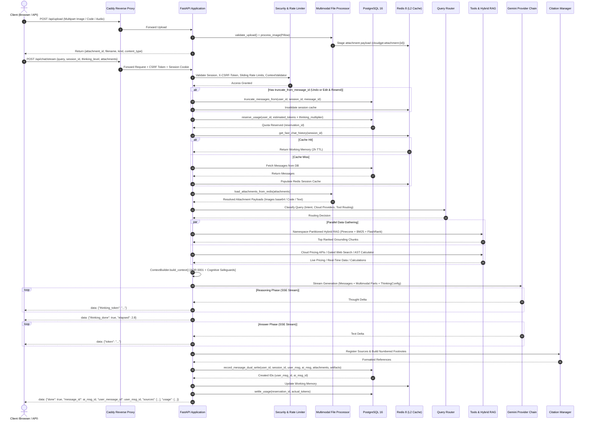

# CloudGPT — System Architecture & Technical Specification

**Document Version:** 2026-09 (Enterprise Multi-Model Architecture, Multimodal I/O, Thinking Engine, Cognitive Safeguards & Message Actions)  
**System Classification:** Enterprise AI Cloud Research, Troubleshooting, IaC & FinOps Orchestration Platform  
**Target Clouds:** Amazon Web Services (AWS), Google Cloud Platform (GCP), Microsoft Azure  

---

## 1. Executive System Architecture Overview

CloudGPT is an enterprise-grade, multi-model AI cloud infrastructure research and orchestration assistant. It enables cloud architects, DevOps practitioners, and FinOps engineers to design multi-cloud architectures, estimate complex infrastructure pricing, perform live troubleshooting, and generate production-ready Infrastructure as Code (IaC) across **Amazon Web Services (AWS)**, **Google Cloud Platform (GCP)**, and **Microsoft Azure**.

The system synthesizes verified cloud documentation (848 services across 27 categories from `Services.md` and Senior Engineer Knowledge Playbooks), real-time web intelligence, deterministic cloud pricing calculations, live Cloud SDK introspection, multimodal input analysis (architecture diagrams, screenshots, audio, and source code files), advanced LLM reasoning ("Thinking Engine") streamed in real time via Server-Sent Events (SSE), and cognitive reasoning anti-degradation safeguards.

### 1.1 High-Level Architecture Topology

```
                                  ┌────────────────────────────────┐
                                  │      Client (Browser / API)    │
                                  │  • chat.js (Orchestrator)      │
                                  │  • chat-attachments.js (Chips) │
                                  │  • chat-actions.js (Toolbars)  │
                                  └───────────────┬────────────────┘
                                                  │ HTTPS / SSE (HTTP/2)
                                                  ▼
                                  ┌────────────────────────────────┐
                                  │       Caddy Reverse Proxy      │
                                  │  (TLS Termination, Compression)│
                                  └───────────────┬────────────────┘
                                                  │ Internal Network (:5001)
                                                  ▼
┌────────────────────────────────────────────────────────────────────────────────────────────────────────┐
│                                         FastAPI Web Application                                        │
│  ┌──────────────────────────────────────────────────────────────────────────────────────────────────┐  │
│  │ Security Middleware: Request ID | CSRF Validation | CSP & Security Headers | Sliding Rate Limiter│  │
│  │ Context Validator (Zero-LLM: Prompt Injection Detection, Secret Scrubbing, Staleness Detection)  │  │
│  └────────────────────────────────────────────────┬─────────────────────────────────────────────────┘  │
│                                                   │                                                    │
│               ┌───────────────────────────────────┼───────────────────────────────────┐                │
│               ▼                                   ▼                                   ▼                │
│  ┌────────────────────────┐         ┌────────────────────────┐         ┌────────────────────────┐      │
│  │    Authentication &    │         │    Chat Orchestrator   │         │    Billing & Admin     │      │
│  │    Session Manager     │         │   (Pipeline & Stream)  │         │  (Stripe/Razorpay/RBAC)│      │
│  └────────────────────────┘         └─────────────┬──────────┘         └────────────────────────┘      │
│               │                                   │                                                    │
│               ▼                                   ▼                                                    │
│  ┌────────────────────────┐         ┌────────────────────────┐         ┌────────────────────────┐      │
│  │ Multimodal Processor   │         │   Message Actions &    │         │   Artifacts Router     │      │
│  │ • Pillow Sanitization  │         │   Turn Truncation      │         │   • Hot Redis Staging  │      │
│  │ • EXIF / Dimension Cap │         │   • Undo & Rollback    │         │   • Durable DB Records │      │
│  │ • Audio / Code Extract │         │   • Feedback (+1 / -1) │         │   • Isolated Downloads │      │
│  └────────────────────────┘         └────────────────────────┘         └────────────────────────┘      │
└───────────────────────────────────────────────────┼────────────────────────────────────────────────────┘
                                                    │
                                                    ▼
┌────────────────────────────────────────────────────────────────────────────────────────────────────────┐
│                                  Multi-Model Agentic Pipeline                                          │
│                                                                                                        │
│  1. Small-Talk Gate (Regex L1 + Embedding Cosine L2) ──► Instant Greeting Bypass (0ms Retrieval)       │
│  2. Semantic Cache (BAAI/bge-small-en-v1.5) ────────────► Cached Responses (<10ms)                    │
│  3. Query Router (Gemini 3.5 Flash Sub-Model) ──────────► Classifies Intent, Providers & Active Routes │
│                                                                                                        │
│  4. Concurrent Data Gathering & Retrieval:                                                             │
│     ├── Multimodal Stage ──────────────► Staged Attachments (Pillow Normalized Images, Audio, Code)    │
│     ├── Hybrid RAG Engine ─────────────► BM25 / CRC32 (Sparse) + Pinecone (Dense) ──► FlashRank Rerank │
│     ├── Cloud Pricing Tools ───────────► Azure Retail Prices API, AWS Pricing, GCP Catalog             │
│     ├── Cloud SDK Live Tools ──────────► AWS Boto3, GCP Cloud SDK, Azure Management Tools              │
│     ├── Expression Calculator ─────────► Safe Deterministic AST Arithmetic Engine                      │
│     └── Gated Web Search Engine ───────► SearXNG Connection Pool (with DuckDuckGo Fallback)            │
│                                                                                                        │
│  5. Context Quality Controller (CQC) ──► URL Dedup, Cloud Provider Rebalancing, Coherence Scoring      │
│  6. Context Builder & Token Budgeter ──► ADR 0001 Layout + Cognitive Scaffolding + Recency Anchor      │
│                                                                                                        │
│  7. Thinking Engine & Reasoning Budgets:                                                               │
│     ├── Apex Tier ─────────────────────► Gemini 3.8 Flash (Max Reasoning: 65,536 tokens, 4.0×)        │
│     ├── Core Tier ─────────────────────► Gemini 3.8 Flash (Deep Reasoning: 24,576 tokens, 2.5×)       │
│     └── Lite Tier ─────────────────────► Gemini 3.8 Flash (Standard Reasoning: 8,192 tokens, 1.5×)     │
│                                                                                                        │
│  8. Cognitive Safeguards Framework ────► 5-Phase Anti-Degradation Rubric + Anti-Self-Grading Bias      │
│  9. Verification & Citations ──────────► Citation Manager (Numbered Reference Attribution)             │
│ 10. SSE Token Streaming & Formatting ──► Splitter (<think>...</think> -> thinking_token, markdown)    │
│ 11. Event Completion Payload ──────────► done: true, message_id, user_message_id, sources, usage       │
└──────────────────────────────┬─────────────────────────────────────────────────┬───────────────────────┘
                               │                                                 │
                               ▼                                                 ▼
┌──────────────────────────────────────────────┐                 ┌──────────────────────────────────────┐
│           PostgreSQL 16 (Primary DB)         │                 │         Redis 8 (L2 Cache & Bus)     │
│  • Threaded Connection Pool (psycopg2)       │                 │  • Dual-write Chat Working Memory    │
│  • User Profiles, Passwords, RBAC Roles      │                 │  • Staged Attachments (1h TTL)       │
│  • Messages (with Attachments & Artifacts)   │                 │  • Staged Artifacts (24h TTL)        │
│  • Message Feedback (Thumbs Up/Down Ratings) │                 │  • LLM Prompt/Response Cache (24h)   │
│  • Artifacts Registry (Durable Metadata)     │                 │  • Sliding-Window Rate Limit ZSETs   │
│  • Quota Reservations & Usage Ledger         │                 │  • Tool Result Cache (1h TTL)        │
│  • Durable Memory & Session Summaries        │                 │  • Single-Flight Locks (45s TTL)     │
│  • GDPR Export & Permanent Account Erasure   │                 │  • In-Memory Fallbacks on Degradation│
└──────────────────────────────────────────────┘                 └──────────────────┬───────────────────┘
                                                                                    │
                                                                                    ▼
                                                                 ┌──────────────────────────────────────┐
                                                                 │          ARQ Background Worker       │
                                                                 │  • Expired Quota Reservation Cleanup │
                                                                 │  • Transactional Email Delivery      │
                                                                 │  • Async RAG Re-ingestion Tasks      │
                                                                 │  • Retry Queue Monitoring (arq:retry)│
                                                                 └──────────────────────────────────────┘
```

---

## 2. End-to-End Request Life Cycle



---

## 3. Multi-Model Tier Architecture & Reasoning Engine

CloudGPT organizes model capabilities into three tiers powered by the unified Gemini 3.8 Flash thinking engine:

```
┌─────────────────────────────────────────────────────────────────────────────┐
│                          Tier Model Routing Matrix                          │
│                                                                             │
│   ┌──────────────┐     ┌──────────────┐     ┌──────────────┐                │
│   │  Lite (Free) │     │  Core (Pro)  │     │  Apex (Max)  │                │
│   └──────┬───────┘     └──────┬───────┘     └──────┬───────┘                │
│          │                    │                    │                        │
│          ▼                    ▼                    ▼                        │
│   Gemini 3.8 Flash     Gemini 3.8 Flash     Gemini 3.8 Flash                │
│   (Budget: 8,192 tok)  (Budget: 24,576 tok) (Budget: 65,535 tok)            │
│          │                    │                    │                        │
│          ▼                    ▼                    ▼                        │
│   Gemini 3.7 Flash     Gemini 3.7 Flash     Gemini 3.7 Flash                │
│          │                    │                    │                        │
│          ▼                    ▼                    ▼                        │
│   Gemini 3.6 Flash     Gemini 3.6 Flash     Gemini 3.6 Flash                │
│          │                    │                    │                        │
│          ▼                    ▼                    ▼                        │
│   Gemini 3.5 Flash     Gemini 3.5 Flash     Gemini 3.5 Flash                │
└─────────────────────────────────────────────────────────────────────────────┘
```

### 3.1 Model Tiers & Allowed Thinking Matrix
Plan-level allowed thinking (`core/entitlements.py`): Lite → Low–High, Core → Low–High, Apex/Developer → Low–Max. Max reasoning is an Apex differentiator.

| Tier \ Model                          | Lite         | Core         | Apex         |
| ------------------------------------- | ------------ | ------------ | ------------ |
| **Free (Lite plan)**                  | L, M, H      | L, M         | L            |
| **Pro (Core plan)**                   | L, M, H      | L, M, H      | L, M         |
| **Max / Developer (Apex plan)**       | L, M, H, Max | L, M, H, Max | L, M, H, Max |

### 3.2 Dynamic Fallbacks & Circuit Breakers
1. **Model Cooldown Circuit Breaker** (`_model_cooldowns` in `llm/provider.py`): Models encountering upstream 503 / 500 / timeout errors automatically trip a 300-second cooldown window, immediately routing incoming queries to the next operational model.
2. **Fail-Fast Quota Guard (`GeminiQuotaExceeded`)**: On HTTP 429 quota exhaustion, bypasses model cascading because all models share the single Google API key, terminating immediately with an actionable upgrade prompt.
3. **Graceful Degraded Execution**: In test or offline environments, in-memory dictionary fallbacks preserve operational uptime across file uploads (`_MEMORY_STAGED`), artifacts (`_MEMORY_ARTIFACTS`), and sliding rate limiters.

---

## 4. Thinking Engine & Cognitive Reasoning Safeguards

### 4.1 Reasoning Levels, Budgets, and Quota Multipliers

| Level      | Reasoning Token Budget | Quota Multiplier | Purpose                                                                   |
| ---------- | ---------------------- | ---------------- | ------------------------------------------------------------------------- |
| **Low**    | ~2,048 tokens          | 1.0×             | Quick lookups, CLI flag syntax, direct service definitions                |
| **Medium** | ~8,192 tokens          | 1.5×             | Multi-service architectural comparisons, trade-off analysis               |
| **High**   | ~24,576 tokens         | 2.5×             | Production IaC generation, security audits, root cause analysis           |
| **Max**    | ~65,536 tokens         | 4.0×             | Zero-trust migrations, enterprise DR architectures, multi-region failover |

### 4.2 Cognitive Reasoning & Quality Safeguards (Anti-Degradation Framework)
Implemented in `llm/system_prompts.py`, `llm/thinking.py`, and `llm/context_builder.py` to resolve benchmark degradation failure modes:
1. **Multi-Part Decomposition & Isolated Fallback (Task 2)**: Avoids blanket `UNKNOWN` answers. Compound questions are broken into independent parts; missing information is strictly isolated to affected components.
2. **Global Premise & Cross-Section Consistency (Task 7)**: Enforces zero contradictions between sibling bullet points, sequential phases, and overarching architecture premises.
3. **Anti-Self-Grading Bias & Calibrated Honesty (Task 10)**: Prevents false claims of 100% compliance or 0 violations without deterministic evidence. Defaults to explicit caveats or partial status.
4. **Dual-Axis Quality (Task 1)**: Technical domain substance and correctness take precedence over superficial metric counting.
5. **Relational Substance in Structured Outputs (Task 8)**: Mandates authentic domain relationships across tabular data rows and columns.

#### 5-Phase Thinking Engine Rubric (`THINKING_REASONING_FRAMEWORK`)
- **Phase 1 - Multi-Part Query Decomposition**: Deconstruct into independent sub-problems.
- **Phase 2 - Substantive Formulation (Dual-Axis Quality)**: Formulate technical core and CLI/IaC commands.
- **Phase 3 - Structural Alignment**: Apply markdown formatting and schema layout.
- **Phase 4 - Global Premise & Cross-Section Consistency Check**: Cross-validate against system premises.
- **Phase 5 - Adversarial Self-Audit (Anti-Self-Grading Bias)**: Audit constraints without confirmation bias.

---

## 5. Multimodal File Processing & Image Sanitization

Implemented in `file_processor.py`:
- **EXIF Stripping**: Automatically strips GPS coordinates, camera metadata, and device profiles using Pillow.
- **Dimension Normalization**: Resizes images exceeding 2048px using Lanczos resampling while preserving aspect ratios.
- **Color Space Conversion**: Converts CMYK, RGBA, and palette images to standard RGB.
- **Magic-Byte Sniffing**: Inspects raw binary signatures to prevent MIME spoofing.
- **Decompression Bomb Guard**: Capped at `_MAX_EXTRACTED_CHARS = 200,000` to prevent archive extraction denial-of-service.
- **Code & Audio Ingestion**: Decodes source code (.py, .ts, .tf, .sh, .sql, .yaml) with UTF-8/Latin-1 auto-detection, and verifies audio formats (MP3, WAV, M4A, OGG).

---

## 6. Interactive Message Actions & Turn Rollback

### 6.1 Action Architecture (`static/js/chat-actions.js` & `api/chat_routes.py`)
- **Inline Edit & Resend**: Truncates history via `POST /api/sessions/{session_id}/truncate` with target `message_id`, deletes subsequent turns from PostgreSQL, clears cache, and re-streams response.
- **Turn Undo**: Reverts conversation to the prior turn, restoring prompt text into the active chat input.
- **Message Feedback**: Interactive 👍 / 👎 buttons with categorized feedback reasons stored idempotently in `message_feedback`.
- **Text-to-Speech (TTS)**: Web Speech API synthesis integration with audio progress indication.
- **Code Saving & CSV Export**: One-click download of code blocks with auto-detected extensions and tabular CSV export.

---

## 7. Artifacts Subsystem

Implemented in `api/artifacts.py`, `db.py`, and `static/js/chat-actions.js`:
```
LLM Stream / User Generation
        │
        ▼
POST /api/artifacts (filename, content, mime, session_id, message_id)
        │
        ├─► Hot Redis Staging (cloudgpt:artifact:{uuid}, TTL 24h)
        │
        └─► Durable Database Registry (artifacts table)
                    │
                    ▼
GET /api/artifacts/{id}/download (Tenant-isolated, safe Content-Disposition headers)
```

---

## 8. Database Schema & Migration Registry

Migrations located in `migrations/*.sql` and applied sequentially via `python migrate.py`:
- `001_security_billing_entitlements.sql`: Core schema (users, messages, subscriptions, quota reservations, usage events).
- `002_performance_indexes.sql`: Composite query indexes for high concurrency.
- `003_fix_subscription_plan_key_constraint.sql`: Plan key enum constraints.
- `004_placeholder.sql` & `005_placeholder.sql`: Reserved sequence placeholders.
- `006_add_user_roles.sql`: User RBAC columns (`role`, `is_admin`).
- `007_bigint_token_counters.sql`: Bigint token window normalization & `session_titles`.
- `008_thinking_tokens.sql`: Dedicated thinking tokens accounting column in `messages`.
- `010_message_metadata.sql`: Attachments & artifacts JSONB columns, `message_feedback`, `artifacts` table.
- `011_session_summary.sql`: Persistent per-session summaries.
- `012_user_memory.sql`: Cross-session durable user memory store.
- `013_user_settings.sql`: User preferences and interface configuration JSONB.

---

## 9. Asynchronous Task Worker (ARQ & Redis)

Decoupled background job processing managed by `worker.py` and `tasks.py`:
- `cleanup_expired_reservations`: Sweeps abandoned token reservations held by dropped client connections.
- `send_transactional_email`: Delivers SMTP verification and password reset links asynchronously.
- `async_reingest_corpus`: Re-indexes documentation chunks and updates Pinecone indexes.
- Health monitoring via `/api/chat/health` tracking `arq:retry:*` error keys.

---

## 10. Automated Testing & Verification

```bash
# Automated verification commands
.venv/Scripts/python -m pytest tests/test_cognitive_safeguards.py -v
.venv/Scripts/python -m pytest tests/test_thinking_engine.py -v
.venv/Scripts/python -m pytest tests/test_multimodal_attachments.py -v
.venv/Scripts/python -m pytest tests/test_message_actions.py -v
.venv/Scripts/python -m pytest tests/test_artifacts.py -v
.venv/Scripts/python -m pytest tests/test_sessions.py -v
.venv/Scripts/python -m pytest tests/test_auth.py -v
.venv/Scripts/python -m ruff check .
```

All 293+ automated tests execute with hermetic test isolation without requiring live third-party cloud credentials.
