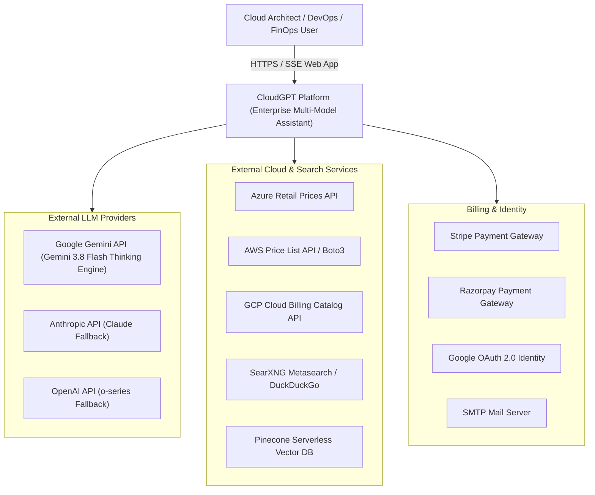
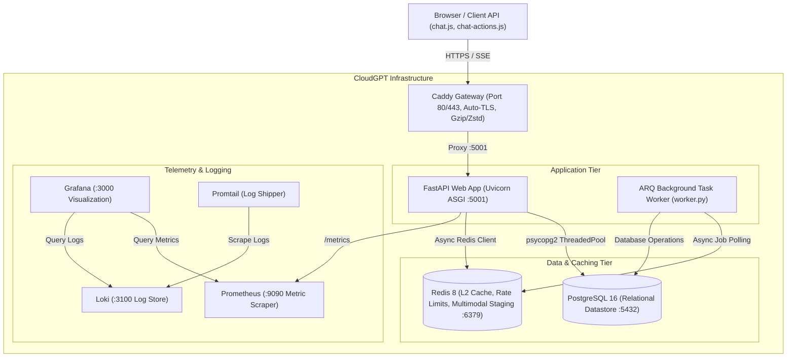
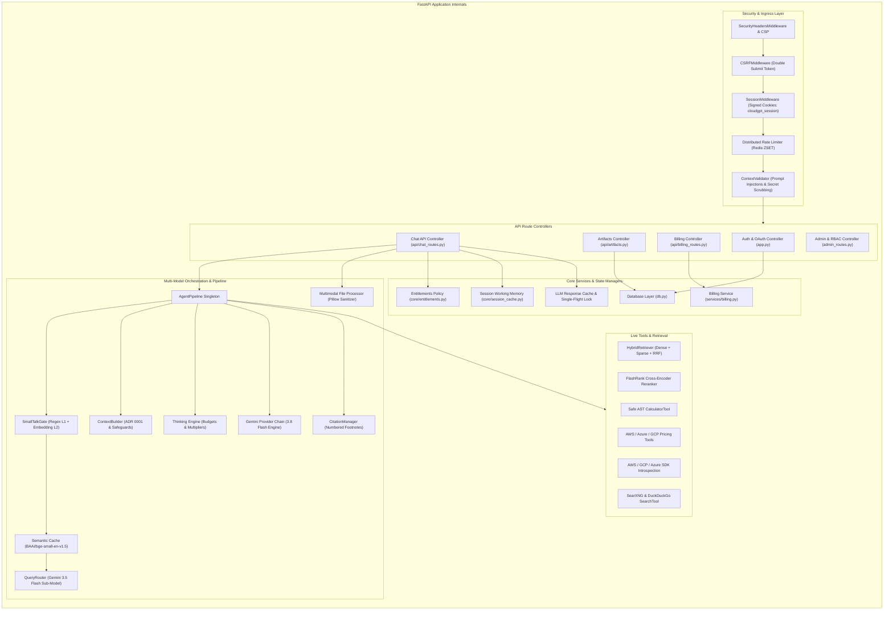
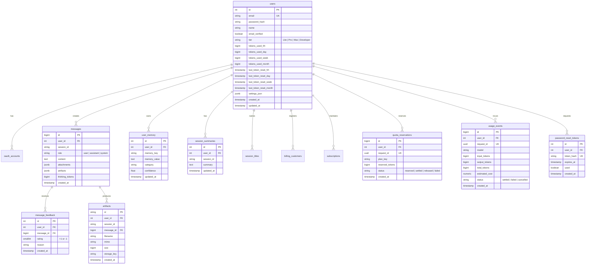

# CloudGPT — System Design Document & Technical Blueprint

**Document Version:** 2026-09 (Enterprise Multi-Model Cloud Intelligence, Multimodal I/O, Cognitive Safeguards & Interactive Message Actions)  
**Status:** Approved & Production-Ready  
**Classification:** Senior Staff / Principal Architecture Specification  
**Target Clouds:** Amazon Web Services (AWS), Google Cloud Platform (GCP), Microsoft Azure  

---

## 1. Executive Summary & Problem Statement

### 1.1 Overview
**CloudGPT** is an enterprise-grade, distributed AI assistant engineered specifically for multi-cloud infrastructure architecture, automated FinOps cost optimization, production root-cause troubleshooting, and Infrastructure as Code (IaC) generation across **Amazon Web Services (AWS)**, **Google Cloud Platform (GCP)**, and **Microsoft Azure**.

Modern cloud environments encompass thousands of managed services, complex regional pricing topologies, ephemeral microservice runtimes, and evolving security compliance frameworks. Architects and DevOps engineers frequently face:
1. **Information Fragmentation:** Navigating thousands of disparate documentation pages, CLI references, and whitepapers.
2. **Pricing Opacity:** Estimating egress, reserved instances, compute SKUs, and cross-provider cost tradeoffs accurately.
3. **Troubleshooting Latency:** Diagnosing distributed failures (e.g., Kubernetes `CrashLoopBackOff`, cross-account IAM permission boundaries, VPC Service Controls) without verified step-by-step remediation playbooks.
4. **LLM Hallucinations:** Generic models generating non-existent CLI flags, deprecated SDK methods, or fabricated cloud SKUs.
5. **Visual Architecture Complexity:** Need to interpret architecture diagrams, VPC flow diagrams, and error screenshots directly alongside code.

### 1.2 Core Value Proposition
CloudGPT resolves these challenges by coupling:
- **Ground Truth Knowledge:** A verified corpus of 848 cloud services across 27 categories (`Services.md`) and curated Senior Engineer Knowledge Playbooks.
- **Multimodal Ingestion Pipeline:** Sanitized image upload (Pillow EXIF removal, Lanczos dimension normalization), audio file analysis, and source code decoding.
- **Deterministic Live Tooling:** Safe AST-based mathematical evaluation, live Cloud Pricing APIs (Azure Retail, AWS, GCP Catalog), real-time Cloud SDK inspection, and SearXNG/DuckDuckGo web search.
- **Dynamic Multi-Model Orchestration:** Tiered LLM routing with native deep reasoning ("Thinking Engine") streamed in real time via Server-Sent Events (SSE).
- **Cognitive Reasoning Safeguards:** Anti-Degradation Framework resolving benchmark failure modes through a 5-phase thinking engine rubric and anti-self-grading bias controls.
- **Interactive Message Actions:** In-place prompt editing & resending, turn undo/rollback via `/api/sessions/{id}/truncate`, feedback tracking, text-to-speech audio synthesis, code saving, and table CSV export.
- **Enterprise Governance:** Multi-window rolling token quota accounting (5-Hour, Daily, Weekly, Monthly), atomic two-phase token reservations, dual-write Redis L2 working memory, multi-gateway billing (Stripe & Razorpay), and GDPR Article 15/17 compliance.

---

## 2. System Architecture & C4 Models

### 2.1 C4 Level 1: System Context Diagram



### 2.2 C4 Level 2: Container Diagram



### 2.3 C4 Level 3: Component Diagram (FastAPI Application)



---

## 3. Multimodal Processing & Image Sanitization Architecture

### 3.1 Ingestion Pipeline (`file_processor.py`)
Uploaded media files undergo strict sanitization before being staged:

```
User Upload (POST /api/upload)
        │
        ▼
1. validate_upload() ──► Magic-Byte Sniffing (%PDF-, PK\x03\x04, \x89PNG, \xff\xd8\xff, RIFF)
        │
        ▼
2. Extension & Size Verification (Tier Quota Gated)
        │
        ▼
3. process_image() [Pillow Engine]:
   • Strip all EXIF / GPS / Device metadata
   • Enforce max_image_dimension (clamp to 2048px via Lanczos filter)
   • Convert CMYK / RGBA to RGB
   • Re-encode sanitized bytes & generate base64 payload
        │
        ▼
4. stage_attachment() ──► Write to Redis (cloudgpt:attachment:{id}, TTL 1h)
   • In-Memory Fallback (_MEMORY_STAGED) if Redis is unavailable
   • Return metadata {attachment_id, filename, size, content_type, kind}
```

### 3.2 Code File Decoding & Audio Verification
- **Code Ingestion**: Decodes `.py, .js, .ts, .json, .yaml, .yml, .tf, .sh, .sql, .html, .css, Dockerfile` with auto-detection of UTF-8 and Latin-1 encodings. Runaway text guard enforces `_MAX_EXTRACTED_CHARS = 200,000`.
- **Audio Verification**: Validates audio formats (MP3, WAV, M4A, OGG, WEBM) via binary header sniffing.

---

## 4. Multi-Model Orchestration & Thinking Engine Design

### 4.1 Model Tier Hierarchy & Routing Matrix

CloudGPT utilizes the unified **Gemini 3.8 Flash Thinking Engine** across all tiers, adjusting reasoning token allocations per user tier:

```
┌─────────────────────────────────────────────────────────────────────────────┐
│                          Tier Model Routing Matrix                          │
│                                                                             │
│   ┌──────────────┐     ┌──────────────┐     ┌──────────────┐                │
│   │  Lite (Free) │     │  Core (Pro)  │     │  Apex (Max)  │                │
│   └──────┬───────┘     └──────┬───────┘     └──────┬───────┘                │
│          │                    │                    │                        │
│          ▼                    ▼                    ▼                        │
│   Gemini 3.8 Flash     Gemini 3.8 Flash     Gemini 3.8 Flash                │
│   (Budget: 8,192 tok)  (Budget: 24,576 tok) (Budget: 65,535 tok)            │
│          │                    │                    │                        │
│          ▼                    ▼                    ▼                        │
│   Gemini 3.7 Flash     Gemini 3.7 Flash     Gemini 3.7 Flash                │
│          │                    │                    │                        │
│          ▼                    ▼                    ▼                        │
│   Gemini 3.6 Flash     Gemini 3.6 Flash     Gemini 3.6 Flash                │
│          │                    │                    │                        │
│          ▼                    ▼                    ▼                        │
│   Gemini 3.5 Flash     Gemini 3.5 Flash     Gemini 3.5 Flash                │
└─────────────────────────────────────────────────────────────────────────────┘
```

### 4.2 Allowed Thinking Matrix
Plan-level allowed thinking (`core/entitlements.py`): Lite → Low–High, Core → Low–High, Apex/Developer → Low–Max.

| Tier \ Model                          | Lite         | Core         | Apex         |
| ------------------------------------- | ------------ | ------------ | ------------ |
| **Free (Lite plan)**                  | L, M, H      | L, M         | L            |
| **Pro (Core plan)**                   | L, M, H      | L, M, H      | L, M         |
| **Max / Developer (Apex plan)**       | L, M, H, Max | L, M, H, Max | L, M, H, Max |

---

## 5. Cognitive Reasoning & Quality Safeguards (Anti-Degradation Framework)

Implemented across `llm/system_prompts.py`, `llm/thinking.py`, and `llm/context_builder.py` to prevent multi-hop reasoning breakdown:

1. **Multi-Part Decomposition & Isolated Fallback (Task 2)**: Compound architectural questions are broken down into independent sub-queries. Information gaps are strictly isolated to affected components rather than returning blanket refusals.
2. **Global Premise & Cross-Section Consistency (Task 7)**: Enforces strict premise harmony across architectural recommendations, CLI scripts, and trade-off tables.
3. **Anti-Self-Grading Bias & Calibrated Honesty (Task 10)**: Eliminates unearned claims of 100% compliance or 0 violations without deterministic evidence. Defaults to explicit caveats or partial status.
4. **Dual-Axis Quality (Task 1)**: Domain correctness and operational depth take precedence over artificial metric counts.
5. **Relational Substance in Structured Outputs (Task 8)**: Enforces meaningful, scenario-specific data in all generated markdown tables and matrices.

### 5-Phase Thinking Engine Rubric (`THINKING_REASONING_FRAMEWORK`)
```
Phase 1 - Multi-Part Query Decomposition:
  ├── Deconstruct compound questions and sibling constraints
  └── Identify independent verifiable tasks
Phase 2 - Substantive Formulation (Dual-Axis Quality):
  ├── Solve technical domain core with exact CLI/IaC commands
  └── Ensure operational correctness before applying formatting
Phase 3 - Structural Alignment:
  ├── Apply markdown formatting, tables, and headers
  └── Ensure layout reflects technical substance
Phase 4 - Global Premise & Cross-Section Consistency Check:
  ├── Audit sequential steps against overarching premises
  └── Ensure zero contradictions between sibling statements
Phase 5 - Adversarial Self-Audit (Anti-Self-Grading Bias):
  ├── Audit constraints from first principles without bias
  └── State explicit limitations, caveats, or partial completion
```

---

## 6. Interactive Message Actions & Turn Rollback

### 6.1 Action Architecture (`static/js/chat-actions.js` & `api/chat_routes.py`)
- **Inline Edit & Resend**: Truncates history via `POST /api/sessions/{session_id}/truncate` with target `message_id`, deletes subsequent turns from PostgreSQL, clears cache, and re-streams response.
- **Turn Undo**: Reverts conversation to the prior turn, restoring prompt text into the active chat input.
- **Message Feedback**: Interactive 👍 / 👎 buttons with categorized feedback reasons stored idempotently in `message_feedback`.
- **Text-to-Speech (TTS)**: Web Speech API synthesis integration with audio progress indication.
- **Code Saving & CSV Export**: One-click download of code blocks with auto-detected extensions and tabular CSV export.

---

## 7. Artifacts Subsystem

Implemented in `api/artifacts.py`, `db.py`, and `static/js/chat-actions.js`:
```
LLM Stream / User Generation
        │
        ▼
POST /api/artifacts (filename, content, mime, session_id, message_id)
        │
        ├─► Hot Redis Staging (cloudgpt:artifact:{uuid}, TTL 24h)
        │
        └─► Durable Database Registry (artifacts table)
                    │
                    ▼
GET /api/artifacts/{id}/download (Tenant-isolated, safe Content-Disposition headers)
```

---

## 8. Database Schema & Migration Registry

Migrations located in `migrations/*.sql` and applied sequentially via `python migrate.py`:



---

## 9. Caching Hierarchy, Keys & Single-Flight Coalescing

### 9.1 Cache Key Registry

| Cache Layer | Redis Key Pattern | TTL | Invalidation Trigger |
|---|---|---|---|
| **Session History** | `session_history:{user_id}:{session_id}` | 7,200s (2h) | Append turn, Clear Chat, Truncate, Logout |
| **LLM Response** | `llm_resp:{corpus_v}:{prompt_v}:{provider}:{hash}` | 86,400s (24h) | Corpus version bump, Prompt edit |
| **Retrieval Cache** | `retrieval:{corpus_v}:{ns}:{hash}` | 3,600s (1h) | Pinecone index update, Ingestion sync |
| **Tool & Pricing** | `tool:pricing:{provider}:{service}:{hash}` | 3,600s (1h) | Pricing API schema update |
| **Web Search Cache**| `tool:web_search:{param_hash}` | 3,600s (1h) | Param hash expiration |
| **User Memory** | `user_mem:{user_id}` | 86,400s (24h) | Memory fact upsert/deletion in Settings UI |
| **Single-Flight Lock** | `single_flight_lock:{query_hash}` | 45s (auto-expire) | Pipeline completion |
| **Staged Attachment** | `cloudgpt:attachment:{attachment_id}` | 3,600s (1h) | Time to live expiration |
| **Staged Artifact** | `cloudgpt:artifact:{storage_key}` | 86,400s (24h) | Time to live expiration |

### 9.2 Single-Flight Distributed Lock (`core/llm_cache.py`)
When multiple identical requests arrive simultaneously, CloudGPT prevents duplicate LLM inference costs and stampedes:
1. Calculates `query_hash = sha256(canonical_query + provider_filter + tier)`.
2. Acquires non-blocking Redis lock `SET single_flight_lock:{hash} {request_id} NX EX 45`.
3. If held by another request, the follower polls for the cached answer in 500ms intervals up to 30s, streaming the result as soon as the leader populates the cache.

---

## 10. Resiliency & Fault Tolerance Matrix

| Component / Subsystem | Failure Scenario | Degradation & Recovery Strategy | Policy |
|---|---|---|---|
| **Redis Cache** | Process crash, network partition, connection refused | Gracefully fall back to in-process memory cache (`MemoryCache`) and local Python dictionaries. Dual-write skips Redis without failing DB writes. | **Fail-Open** |
| **Pinecone Vector DB** | HTTP 503, API timeout, dimension mismatch | Hybrid retriever immediately falls back to sparse BM25s lexical search. Increments `cloudgpt_rag_fallback_total`. | **Fail-Open** |
| **FlashRank Reranker** | Model unreadable, CPU out of memory | Returns raw RRF-fused results in ranked order. Omits reranking step. | **Fail-Open** |
| **SearXNG Search** | Service timeout, zero search results | Falls back to DuckDuckGo HTML scraping. If all search providers fail, proceeds with internal RAG corpus only. | **Fail-Open** |
| **Gemini Overload (503/504)**| High demand, transient cluster failure | Automatically walks fallback cascade (3.8F → 3.7F → 3.6F → 3.5F → 3.5F-Lite). Trips 300s circuit breaker cooldown on failed model. | **Graceful Cascade** |
| **Gemini Quota Limit (429)** | Free tier quota exhausted (`RESOURCE_EXHAUSTED`)| Throws `GeminiQuotaExceeded`. Bypasses the fallback chain immediately because all models share one project API key. Returns clear upgrade CTA. | **Fail-Fast** |
| **PostgreSQL Pool** | Connection pool exhausted (`max=30`) | Connection requests wait up to 5s before raising a 503 Service Unavailable error. Read operations fall back to Redis session cache. | **Fail-Safe** |
| **Context Validator** | Prompt injection attack detected | If `context_validator_fail_closed=True`, rejects request with HTTP 400. If credentials detected, scrubs with `[REDACTED]` and proceeds. | **Fail-Closed (Injection) / Scrub (Secrets)** |
| **ARQ Worker Offline** | Worker process crashed | API enqueues tasks to Redis queue; tasks persist until worker restarts. Non-critical jobs skip execution without impacting user streams. | **Graceful Queueing** |

---

## 11. Latency Budgets & SLA Allocations

| Pipeline Stage | Free (Lite) Budget | Pro (Core) Budget | Max (Apex) Budget | Implementation Reference |
|---|---|---|---|---|
| **Query Routing & SmallTalk** | $\le 15\text{ms}$ (Bypass) | $\le 300\text{ms}$ | $\le 300\text{ms}$ | `router/smalltalk_gate.py` |
| **Hybrid Retrieval & Search** | $\le 300\text{ms}$ | $\le 600\text{ms}$ (Multi-hop) | $\le 1200\text{ms}$ (HyDE + Live) | `retrieval/hybrid.py` |
| **Cross-Encoder Reranking** | $\le 250\text{ms}$ | $\le 350\text{ms}$ | $\le 450\text{ms}$ | `retrieval/reranker.py` |
| **Context Assembly (ADR 0001)**| $\le 30\text{ms}$ | $\le 50\text{ms}$ | $\le 80\text{ms}$ | `llm/context_builder.py` |
| **Time to First Token (TTFT)** | $\le 800\text{ms}$ | $\le 1200\text{ms}$ | $\le 1500\text{ms}$ | `llm/provider.py` |
| **Total Turn Deadline** | $\le 15,000\text{ms}$ | $\le 25,000\text{ms}$ | $\le 45,000\text{ms}$ | `chat_routes.py` |
