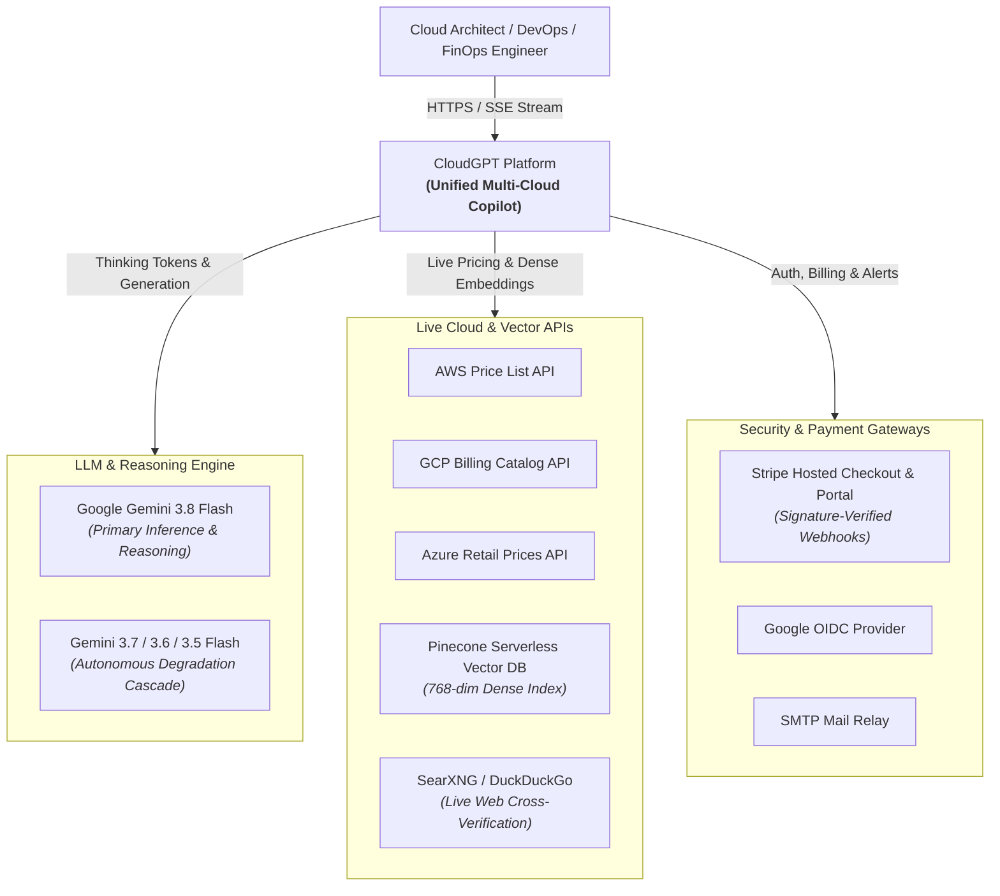
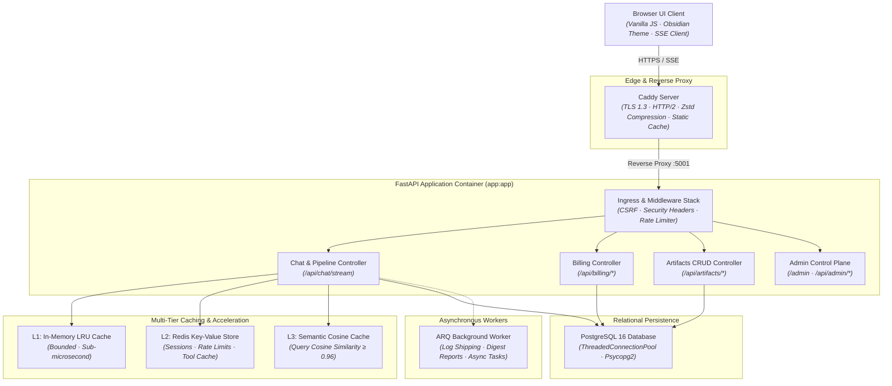
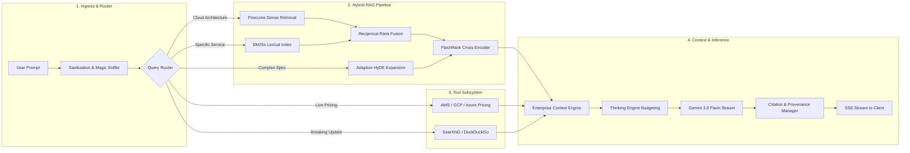
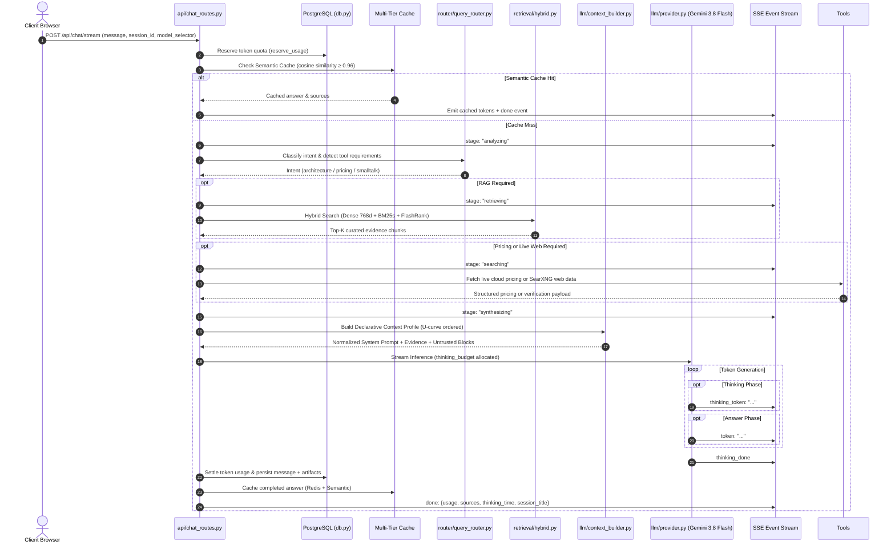
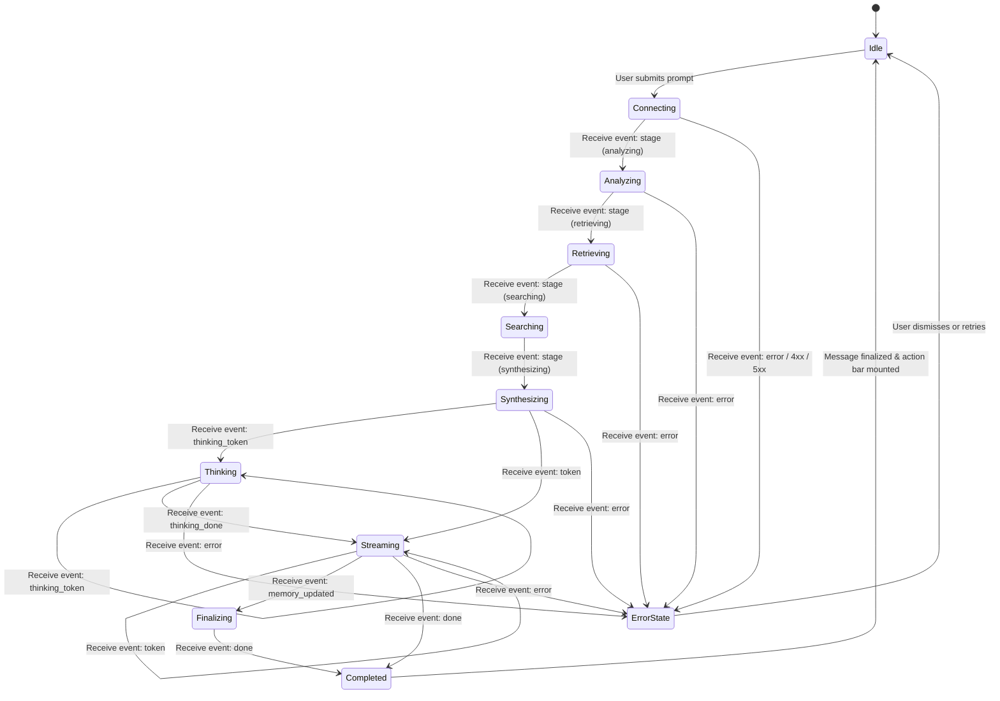
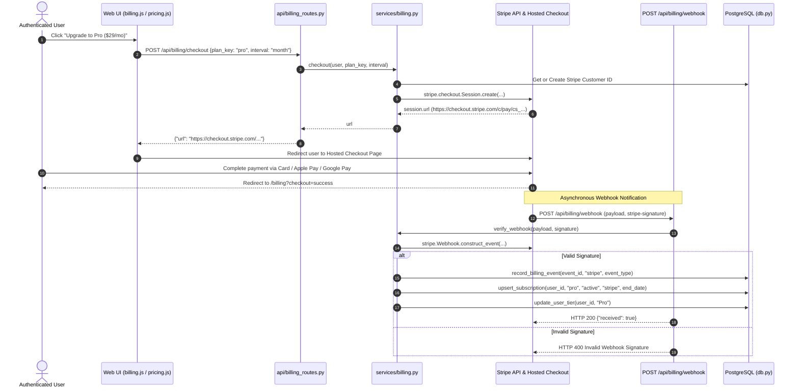
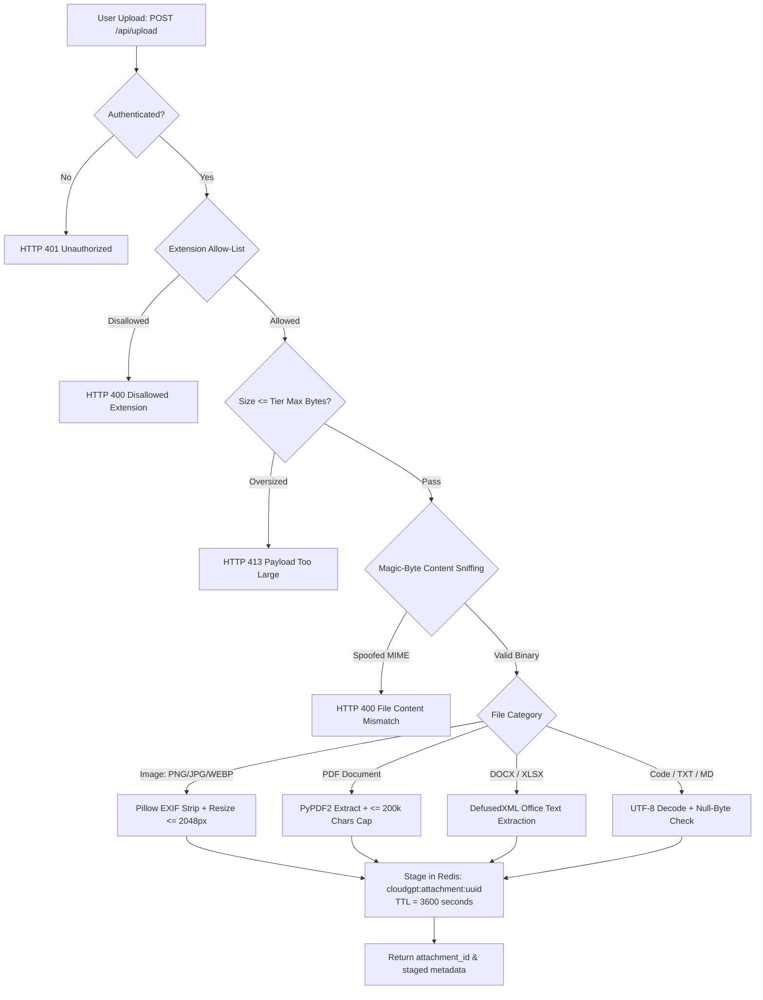
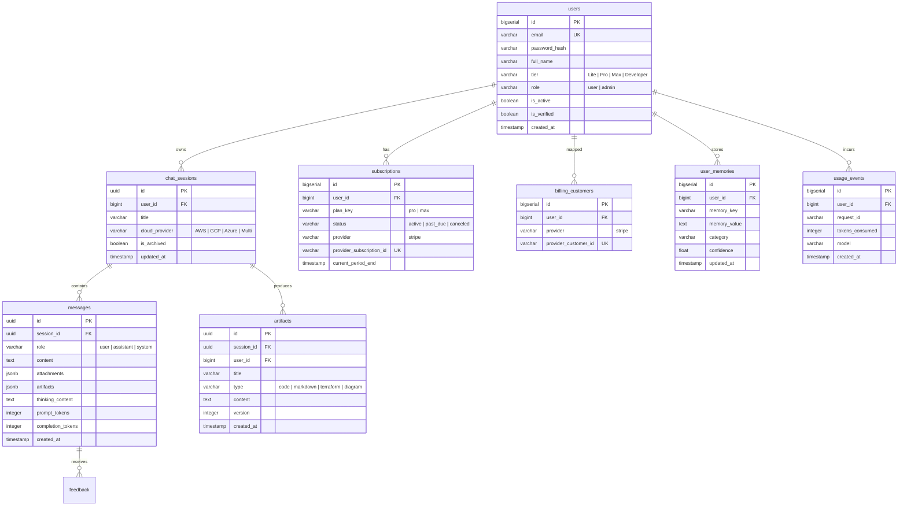

# CloudGPT — Enterprise System Architecture Specification

```
═══════════════════════════════════════════════════════════════════════════════════════════════════════
 DOCUMENT VERSION : 2026-09 (Enterprise Multi-Model Architecture & Complete File-by-File Blueprint)
 SYSTEM CLASS     : Enterprise Multi-Cloud Research, Troubleshooting, IaC & FinOps Copilot Platform
 TARGET CLOUDS    : Amazon Web Services (AWS) · Google Cloud Platform (GCP) · Microsoft Azure
 REPOSITORY ROOT  : C:\CloudGPT
 PAYMENT GATEWAY  : Stripe Hosted Checkout & Customer Portal (Exclusive)
 LLM BACKBONE     : Gemini Flash Cascade (gemini-3.8-flash → 3.7 → 3.6 → 3.5)
 SECURITY POSTURE : Zero-Trust Ingress · Dual-Token CSRF · Strict CSP · Magic-Byte Sniffing · Sandboxed
═══════════════════════════════════════════════════════════════════════════════════════════════════════
```

---

## 1. Executive Overview & Multi-Cloud Domain Scope

### 1.1 Purpose & Mission

**CloudGPT** is an enterprise-grade AI cloud research assistant and architectural copilot engineered specifically for multi-cloud environments across **Amazon Web Services (AWS)**, **Google Cloud Platform (GCP)**, and **Microsoft Azure**.

General-purpose Large Language Models (LLMs) suffer from severe hallucinations, stale pricing figures, regional service discrepancies, fabricated CLI flags, and shallow synthesis when addressing complex infrastructure queries. CloudGPT eliminates these failure modes through:

- **Deterministic Multi-Stage Hybrid RAG**: Merging 768-dimensional dense vector embeddings with sparse BM25s lexical indexing via Reciprocal Rank Fusion (RRF) and FlashRank cross-encoder reranking.
- **Unified Gemini Flash Cascade**: Powered exclusively by `gemini-3.8-flash` with automatic fallback to `3.7-flash`, `3.6-flash`, and `3.5-flash` across all tiers.
- **Dynamic Reasoning Thinking Engine**: Real-time chain-of-thought budgets ranging from **Low** (~1,024 tokens) to **Max** (~65,536 tokens) with collapsible thinking accordion streaming.
- **Enterprise Context Engine**: Strict context token budgets (Lite: 8K, Pro: 32K, Max: 64K, Developer: 128K), untrusted injection encapsulation (`<untrusted_content>`), and U-curve attention ordering optimizations.
- **Authoritative Multi-Cloud Pricing Engine**: Real-time pricing lookups against AWS Price List, Azure Retail Prices, and GCP Cloud Billing Catalog APIs.
- **Exclusive Stripe Billing Architecture**: Seamless hosted Stripe Checkout redirection, self-serve Customer Portal, and signature-verified webhook subscription lifecycle tracking.
- **Persistent Infrastructure Memory**: Durable cross-session user memory retaining VPC topologies, organizational standards, and cloud preferences.

### 1.2 Multi-Cloud Knowledge Corpus

CloudGPT's retrieval corpus indexes **848 cloud services** across 27 catalog categories and 15 cloud architecture lifecycle stages:

```
┌─────────────────────────────────────────────────────────────────────────────────────────────────┐
│                                  848 CURATED CLOUD SERVICES                                     │
├───────────────────────────────┬─────────────────────────────────┬───────────────────────────────┤
│     AMAZON WEB SERVICES       │     GOOGLE CLOUD PLATFORM       │        MICROSOFT AZURE        │
├───────────────────────────────┼─────────────────────────────────┼───────────────────────────────┤
│ • Compute: EC2, Lambda, ECS,  │ • Compute: Compute Engine, GKE, │ • Compute: Virtual Machines,  │
│   EKS, Fargate, App Runner    │   Cloud Run, Cloud Functions    │   AKS, Container Apps, App Svc│
│ • Storage: S3, EBS, EFS, FSx  │ • Storage: Cloud Storage,       │ • Storage: Blob, Files, NetApp│
│ • Database: Aurora, DynamoDB, │   Filestore, Persistent Disk    │ • Database: Cosmos DB, Azure  │
│   RDS, Redshift, ElastiCache  │ • Database: Cloud Spanner,      │   SQL, Synapse, Redis Cache   │
│ • Network: VPC, Transit GW,   │   BigQuery, Cloud SQL, Bigtable │ • Network: VNet, Virtual WAN, │
│   Route 53, Direct Connect    │ • Network: VPC, Cloud Armor,    │   ExpressRoute, Private Link  │
│ • Security: IAM, KMS, Guard-  │   Cloud NAT, Interconnect       │ • Security: Entra ID, Key     │
│   Duty, Secrets Mgr, WAF      │ • Security: Cloud IAM, KMS,     │   Vault, Defender, Sentinel   │
│ • AI/ML: SageMaker, Bedrock   │   Secret Mgr, Security Command  │ • AI/ML: Azure OpenAI,        │
│ • FinOps: Cost Explorer, AWS  │ • AI/ML: Vertex AI, BigQuery ML │   Machine Learning Studio     │
│   Budgets, Compute Optimizer  │ • FinOps: Cloud Billing, Recom. │ • FinOps: Cost Management     │
└───────────────────────────────┴─────────────────────────────────┴───────────────────────────────┘
```

---

## 2. Global Architectural Topology & C4 Models

CloudGPT operates as an asynchronous, decoupled, multi-tier platform built on FastAPI, PostgreSQL, Redis, and Vanilla ES6+ Web Components.

### 2.1 C4 Level 1: System Context Diagram



---

### 2.2 C4 Level 2: Container Topology



---

### 2.3 C4 Level 3: Component Architecture (Chat & Retrieval Engine)



---

## 3. Unified 8-Stage Agent Execution Pipeline

Every user message sent to `/api/chat/stream` or `/api/chat` passes through a single, deterministic execution pipeline (`api/chat_routes.py:execute_agent_pipeline`).



---

## 4. SSE Streaming Protocol & State Machine

The `/api/chat/stream` endpoint implements an additive, backward-compatible SSE contract.

### 4.1 Client SSE State Machine



### 4.2 SSE Event Catalog

| Event Type            | Emitted By            | Payload Structure                                                        | Description                                     |
| --------------------- | --------------------- | ------------------------------------------------------------------------ | ----------------------------------------------- |
| `stage`             | Pipeline Orchestrator | `{"stage": "analyzing" \| "retrieving" \| "searching" \| "synthesizing"}` | Drives frontend step progression indicator      |
| `provider_detected` | Pipeline Orchestrator | `{"provider": "gemini"}`                                               | Identifies active inference engine              |
| `session_title`     | Auto-titler           | `{"title": "EKS Auto-Scaling VPC Design"}`                             | Dynamically titles new conversations            |
| `thinking_token`    | Gemini Provider       | `{"token": "Evaluating ALB vs NLB trade-offs..."}`                     | Streams into collapsible thinking accordion     |
| `thinking_done`     | Gemini Provider       | `{}`                                                                   | Closes the thinking stream; opens answer stream |
| `token`             | Gemini Provider       | `{"token": "Architectural recommendation: ..."}`                       | Streams formatted Markdown tokens into UI       |
| `memory_updated`    | Memory Manager        | `{"key": "cloud_provider", "value": "AWS"}`                            | Signals durable architectural memory update     |
| `error`             | Exception Handler     | `{"error": "Quota exceeded", "code": 429}`                             | Renders actionable user-tier error notification |
| `done`              | Pipeline Finalizer    | `{"usage": {...}, "sources": [...], "session_id": "..."}`              | Completes turn, settles quota, mounts actions   |

---

## 5. Multi-Tier Caching & Memory Architecture

To minimize token expenditure and latency, CloudGPT employs a 4-tier caching topology:

```mermaid
graph TD
    Query[User Query Ingress] --> L1{L1: In-Memory LRU Cache}
    L1 -->|Hit (<1ms)| ReturnL1[Instant Answer Return]
    L1 -->|Miss| L2{L2: Redis Distributed Cache}
    L2 -->|Hit (<5ms)| ReturnL2[Hydrate Session / Tool Cache]
    L2 -->|Miss| L3{L3: Semantic Cosine Cache}
    L3 -->|Hit (<50ms)| ReturnL3[Return Synthesized Answer]
    L3 -->|Miss| L4{L4: Vector Index & Hybrid RAG}
    L4 --> FreshInference[Execute Fresh Inference & Dual-Write Back]
    FreshInference -.->|Write Back| L1
    FreshInference -.->|Write Back| L2
    FreshInference -.->|Write Back| L3
```

| Cache Layer             | Mechanism                   | Key / Location                                | TTL                            | Eviction Policy           | Purpose                                         |
| ----------------------- | --------------------------- | --------------------------------------------- | ------------------------------ | ------------------------- | ----------------------------------------------- |
| **L1: Memory**    | Python`OrderedDict` LRU   | `core/memory_cache.py`                      | 5 minutes                      | Max 10,000 keys (LRU)     | Sub-microsecond local process cache             |
| **L2: Key-Value** | Redis 7.2 Standalone        | `cloudgpt:session:{id}cloudgpt:tool:{hash}` | 2 hours (Session)1 hour (Tool) | volatile-lru              | Distributed multi-instance state & tool results |
| **L3: Semantic**  | Cosine Similarity (≥ 0.96) | `core/semantic_cache.py`                    | 24 hours                       | Periodic TTL expiry       | Eliminates identical LLM re-computations        |
| **L4: Vector DB** | Pinecone Serverless         | Namespaces:`v1`, `v2`                     | Persistent                     | Immutable versioned index | 768-dim dense index over 848 cloud services     |

---

## 6. Exclusive Stripe Billing & Subscription Topology

CloudGPT operates an exclusive **Stripe** payment integration. All legacy payment systems have been completely eradicated.



### 6.1 Plan Structure & Pricing Matrix (USD)

| Plan Tier           | Monthly Price       | Annual Price        | Model Access            | Thinking Range  | 5-Hour Token Budget | Weekly Token Budget |
| ------------------- | ------------------- | ------------------- | ----------------------- | --------------- | ------------------- | ------------------- |
| **Lite**      | **$0** (Free) | **$0**        | Lite (Gemini 3.8 Flash) | Low–High       | 50,000              | 300,000             |
| **Pro**       | **$29 / mo**  | **$290 / yr** | Core + Lite             | Low–High       | 250,000             | 2,000,000           |
| **Max**       | **$79 / mo**  | **$790 / yr** | Apex + Core + Lite      | Low–Max (~65k) | 500,000             | 15,000,000          |
| **Developer** | Internal Bypass     | Internal Bypass     | Full Access             | Low–Max (~65k) | 10,000,000          | Unlimited           |

---

## 7. Multimodal Security & Single Upload Funnel

To prevent remote code execution, decompression bombs, and prompt injection from untrusted files, all file input passes through a single fortified funnel (`file_processor.py`).



---

## 8. Relational Database Schema Topology

PostgreSQL serves as the system of record. Concurrency is managed via synchronous `psycopg2` inside an isolated `ThreadedConnectionPool`, offloaded to background threads using `asyncio.to_thread()`.



---

## 9. Observability & Telemetry Infrastructure

CloudGPT exposes production-grade Prometheus metrics and structured JSON logging for monitoring:

```
┌────────────────────────────────────────────────────────────────────────────────────────┐
│                                OBSERVABILITY STACK                                     │
├────────────────────────────────┬───────────────────────────────────────────────────────┤
│ Endpoint: `/metrics`           │ Prometheus exposition format                          │
│ Time-to-First-Token (TTFT)     │ `cloudgpt_ttft_seconds` (Histogram, buckets 0.1s→10s) │
│ Stage Duration Metrics         │ `cloudgpt_rag_stage_duration_seconds` (By stage)       │
│ Request Counters               │ `cloudgpt_chat_requests_total` (By tier, model, status)│
│ Token Consumption Counters     │ `cloudgpt_token_usage_total` (Prompt & Completion)    │
│ Cache Performance Gauges       │ `cloudgpt_cache_hits_total` / `cloudgpt_cache_misses`  │
│ Database Pool Gauges           │ `cloudgpt_db_pool_connections_active` (Max: 30)      │
│ Structured Logging             │ Structlog JSON formatter with request_id & user_id    │
└────────────────────────────────┴───────────────────────────────────────────────────────┘
```

---

## 10. Security & Defense-in-Depth Posture

1. **Content Security Policy (CSP)**:
   - Scripts: `'self'`, `'unsafe-inline'`, `https://cdn.jsdelivr.net`, `https://cdnjs.cloudflare.com`, `https://js.stripe.com`.
   - Frames: `https://js.stripe.com`, `https://checkout.stripe.com`.
   - Connects: `'self'`, `https://api.stripe.com`.
   - Razorpay completely excluded from all directives.
2. **CSRF Protection**:
   - Double-submit cookie with cryptographic verification on all mutating requests (`POST`, `PUT`, `DELETE`).
   - Web UI extracts CSRF token from `<meta name="csrf-token">` and sends `X-CSRF-Token` header.
3. **Prompt Injection & Untrusted Boundary**:
   - All retrieved context, web pages, and uploaded attachments are wrapped in strict `<untrusted_content>` tags.
   - System prompts instruct the LLM to treat untrusted blocks purely as data references, ignoring embedded instructions.
4. **Secret Redaction**:
   - Regex-based scrubbing filters AWS Access Keys (`AKIA...`), GCP Service Account JSON keys, and Azure Connection Strings before logging or sending context to LLMs.
