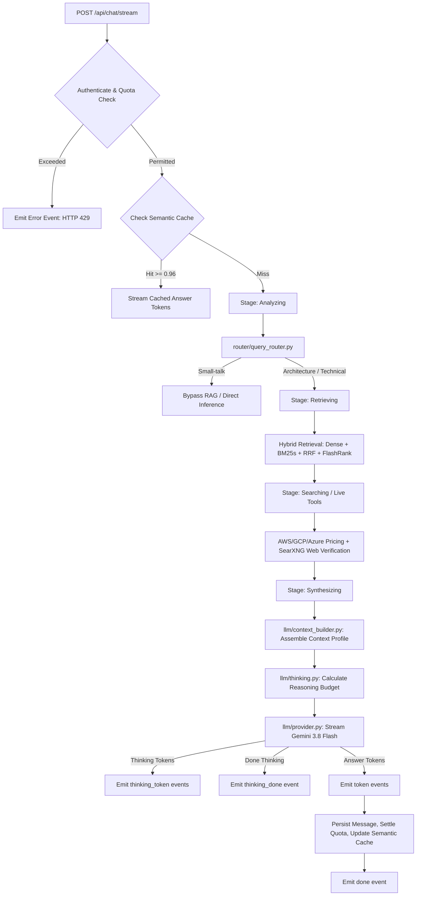
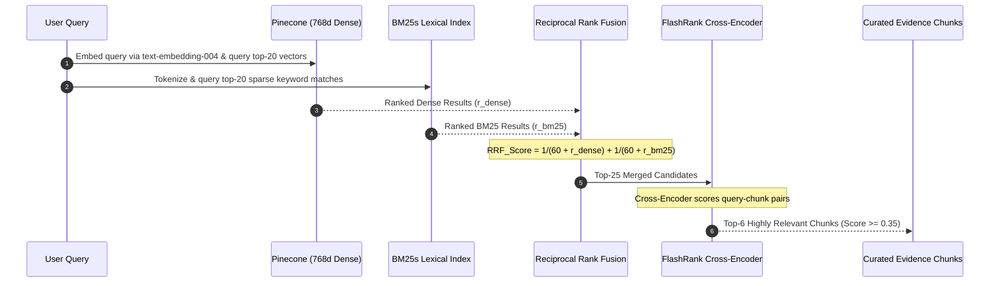
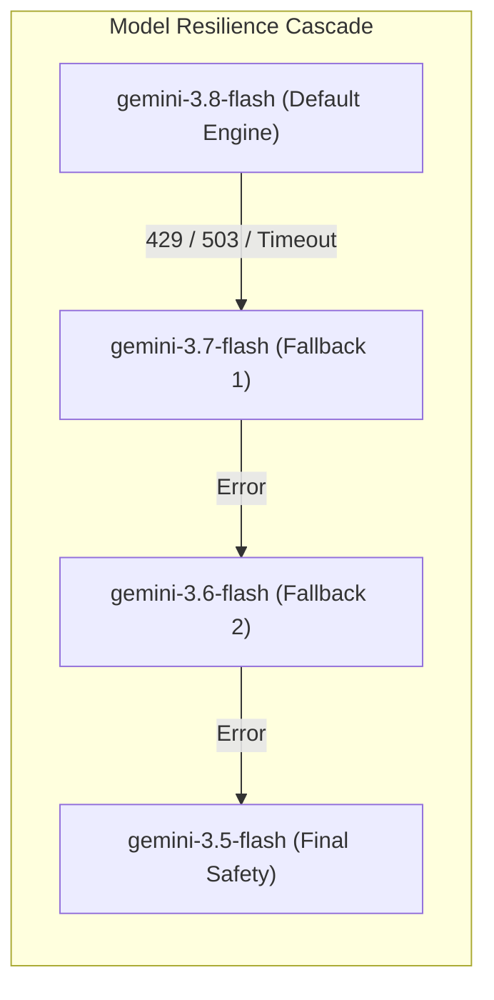
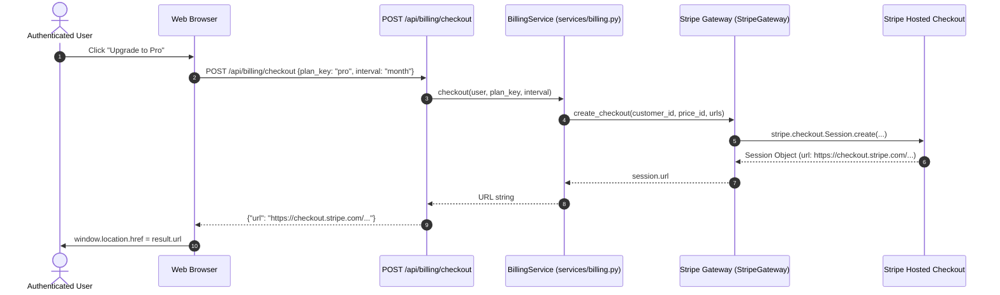
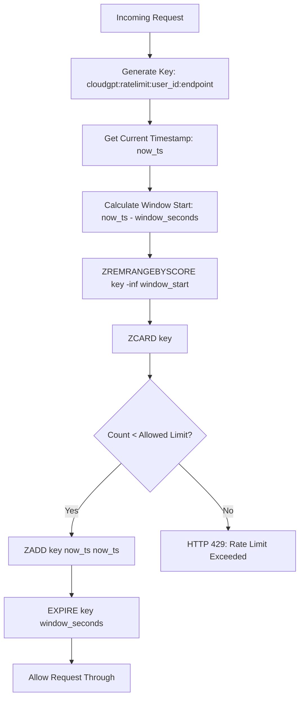

# CloudGPT — Comprehensive System Design Blueprint

```
═══════════════════════════════════════════════════════════════════════════════════════════════════════
 DOCUMENT VERSION : 2026-09 (Enterprise Cloud Intelligence, Context Engine & Complete File Blueprint)
 STATUS           : Approved & Production-Ready
 CLASSIFICATION   : Senior Staff / Principal Architecture Specification
 REPOSITORY ROOT  : C:\CloudGPT
 PAYMENT SYSTEM   : Stripe Exclusive (Hosted Checkout · Customer Portal · Signature Webhook)
 LLM CASCADE      : Gemini 3.8 Flash → 3.7 Flash → 3.6 Flash → 3.5 Flash
 CONTEXT PROFILES : Lite: 8K · Pro: 32K · Max: 64K · Developer: 128K
═══════════════════════════════════════════════════════════════════════════════════════════════════════
```

---

## 1. System Design Principles & Domain Contracts

CloudGPT is engineered according to core enterprise systems principles:

1. **Deterministic Context Quality Over Unbounded Window Growth**: Rather than naively packing prompts up to raw LLM limits, CloudGPT enforces strict, declarative context profiles (Lite: 8K, Pro: 32K, Max: 64K, Developer: 128K). Evidence is ordered via empirical U-curve attention distributions (placing high-relevance chunks at the front and back of the context window), and untrusted data is encapsulated in `<untrusted_content>` tags.
2. **Fail-Open Resilience for Dependent Subsystems**: If Redis, Pinecone, SearXNG, or the FlashRank reranker fail or experience network timeouts, the pipeline never crashes. It gracefully falls back to in-process LRU memory caching, sparse BM25s lexical search, DuckDuckGo web scraping, or raw RRF reciprocal rank scores.
3. **Fail-Fast for Exhausted Quotas**: When user-tier limits or project-level API quotas are reached (`RESOURCE_EXHAUSTED` / HTTP 429), the system terminates execution immediately rather than walking pointless model fallback cascades, saving latency and providing transparent user notifications.
4. **Strict Additive Evolution of the Frontend Contract**: The SSE streaming protocol (`/api/chat/stream`) evolves only through new event types (`stage`, `thinking_token`, `thinking_done`, `memory_updated`, `done`). Existing event shapes remain strictly backward-compatible.
5. **Single Upload Funnel**: Every user-provided file enters through `POST /api/upload`, undergoing magic-byte MIME sniffing, Pillow image sanitization, runaway text extraction caps (200k chars), and Redis staging under a 1-hour TTL.
6. **Exclusive Stripe Payment Gateway**: All billing, checkout, and subscription lifecycle tracking routes strictly through Stripe (`stripe.checkout.Session`, `stripe.billing_portal.Session`, and signature-verified webhooks).

---

## 2. Complete File-by-File Technical Blueprint

Every folder and file in `C:\CloudGPT` has a clearly demarcated, modular responsibility.

```
c:\CloudGPT
├── app.py                      # FastAPI Application Factory, Middleware & Page Routes
├── config.py                   # Pydantic Settings & Unified Environment Configuration
├── db.py                       # PostgreSQL Database Layer (psycopg2 ThreadedConnectionPool)
├── admin_routes.py             # Administrative RBAC Dashboard & User Control Plane
├── file_processor.py           # Multimodal Upload Funnel & Magic-Byte Validation
├── email_service.py            # Transactional Email Engine (aiosmtplib)
├── metrics.py                  # Prometheus Metrics Registry & Instrumentations
├── logging_config.py           # Structlog JSON Logging Formatter
├── tasks.py & worker.py        # ARQ Background Task Definitions & Worker
├── init_db.py & migrate.py     # Database Initialization & Versioned Migrations
├── ingest_services.py          # RAG Corpus Embedder & Pinecone Index Builder
├── api/                        # API Sub-Routers
│   ├── chat_routes.py          # Unified Agent Pipeline & SSE Streaming Endpoint
│   ├── billing_routes.py       # Stripe Checkout, Portal & Webhook Handlers
│   └── artifacts.py            # Interactive Workspace Artifacts CRUD API
├── core/                       # Core Security & Caching Infrastructure
│   ├── entitlements.py         # Plan Quotas, Tier Permissions & Model Gating Authority
│   ├── security.py             # CSRF, Security Headers, Passwords & JWT Tokens
│   ├── rate_limit.py           # Sliding-Window Rate Limiter (Redis + In-Memory Fallback)
│   ├── redis_client.py         # Redis Connection Pool & Graceful Degraded Mode
│   ├── session_cache.py        # Dual-Write Session History Cache
│   ├── semantic_cache.py       # Cosine Similarity Vector Cache (≥ 0.96)
│   ├── memory_cache.py         # In-Memory LRU Process Cache
│   └── tool_cache.py           # Bounded Tool & Pricing Result Cache
├── llm/                        # Language Model & Context Engine
│   ├── provider.py             # LLMProvider ABC & Gemini Flash Cascade (3.8→3.7→3.6→3.5)
│   ├── thinking.py             # Dynamic Thinking Engine & Reasoning Budgets (~65k)
│   ├── context_builder.py      # Declarative Context Profile Builder & U-Curve Optimizer
│   └── system_prompts.py       # System Personas & Senior Engineer Decision Playbooks
├── retrieval/                  # Multi-Stage Hybrid RAG Engine
│   ├── dense.py                # Pinecone Dense Vector Retrieval (768-dim)
│   ├── bm25.py                 # BM25s Lexical Sparse Search (848 Services)
│   ├── hybrid.py               # Reciprocal Rank Fusion (RRF: k=60)
│   ├── reranker.py             # FlashRank Cross-Encoder Reranker
│   ├── adaptive_rag.py         # HyDE (Hypothetical Document Embeddings) & Query Expansion
│   └── agentic_rag.py          # Multi-Step Autonomous Architecture Synthesis
├── embeddings/                 # Vector Embeddings Subsystem
│   ├── embedding_engine.py     # Gemini Text Embeddings (`text-embedding-004`)
│   └── pinecone_manager.py     # Pinecone Serverless Namespace & Index Manager
├── chunking/                   # Semantic Document Chunking
│   ├── semantic_chunker.py     # Header-Aware Markdown Chunking
│   └── metadata_extractor.py   # Cloud Provider, Category & Service Metadata Extractor
├── citations/                  # Provenance & Citation Verification
│   └── citation_manager.py     # Bracketed Source Citations & Documentation Deep Links
├── router/                     # Ingress Query Router
│   └── query_router.py         # Fast Small-Talk Filter & Tool Requirement Gating
├── tools/                      # Deterministic Tools
│   ├── web_search.py           # SearXNG Metasearch with DuckDuckGo Fallback
│   └── calculator.py           # FinOps Multi-Cloud Cost Calculator
├── cloud_apis/                 # Real-Time Cloud Provider Pricing & Catalog APIs
│   ├── aws_pricing.py          # AWS Price List API & Boto3 Wrapper
│   ├── gcp_pricing.py          # GCP Cloud Billing Catalog API Wrapper
│   └── azure_pricing.py        # Azure Retail Prices REST API Wrapper
├── services/                   # Business Services
│   └── billing.py              # Pure Stripe Gateway, USD Plan Catalog & Webhook Handler
├── static/                     # Frontend Assets & Client Scripts
│   ├── js/chat.js              # SSE Streaming Client & Markdown Message Builder
│   ├── js/chat-actions.js      # Message Action Bar (Copy, Fork, Regenerate, Edit, Pin)
│   ├── js/chat-attachments.js  # Drag-and-Drop File Upload & Pill Staging
│   ├── js/billing.js           # Stripe Hosted Checkout Redirect & Customer Portal Client
│   ├── js/pricing.js           # Pricing Plan Cards & Checkout Triggers
│   └── css/chat.css            # Vanilla Obsidian Dark Theme & CSS Design System
└── templates/                  # Jinja2 Enterprise Web Templates
```

---

## 3. Subsystem Detailed Specifications

### 3.1 `api/chat_routes.py` — Unified Agent Execution Pipeline

The single entry point for all conversation requests is `execute_agent_pipeline`. Both the non-streaming `POST /api/chat` and the real-time SSE endpoint `POST /api/chat/stream` execute this function.



### 3.2 `retrieval/` — Multi-Stage Hybrid RAG Pipeline

CloudGPT combines dense vector search with sparse lexical indexing to guarantee accurate retrieval of both broad architectural patterns and exact service identifiers.



### 3.3 `llm/` — Multi-Model Thinking & Context Engine

CloudGPT standardizes on the **Google Gemini Flash Cascade** across all user tiers:



#### Dynamic Thinking Engine (`llm/thinking.py`)

The user selects reasoning modes based on their tier:

```
┌──────────────┬────────────────────────┬──────────────────────┬────────────────────────────────┐
│ THINKING TIER│ REASONING TOKEN BUDGET │ USER-FACING MODE     │ INTENDED ARCHITECTURAL WORKLOAD│
├──────────────┼────────────────────────┼──────────────────────┼────────────────────────────────┤
│ Low          │ ~1,024 tokens          │ Lite / Fast Mode     │ Quick syntax, CLI lookups      │
│ Medium       │ ~4,096 tokens          │ Core / Standard Mode │ Service comparisons, IAM rules │
│ High         │ ~16,384 tokens         │ Core / Deep Mode     │ Multi-VPC architecture, FinOps │
│ Max          │ ~65,536 tokens         │ Apex Mode (Max Only) │ Complex enterprise migrations   │
└──────────────┴────────────────────────┴──────────────────────┴────────────────────────────────┘
```

#### Declarative Context Engine (`llm/context_builder.py`)

Evidence chunks are ordered according to the **U-Curve Attention Distribution** (`[Chunk 1, Chunk 3, ..., Chunk 4, Chunk 2]`):

```
┌────────────────────────────────────────────────────────────────────────────────────────┐
│                          U-CURVE CONTEXT TOKEN LAYOUT                                  │
├────────────────────────────────────────────────────────────────────────────────────────┤
│  1. System Prompt & Senior Engineer Decision Playbook                                  │
│  2. Top Ranked Retrieval Evidence (Highest Relevance Chunks: #1, #2)                   │
│  3. Real-Time Tool & Pricing Results (Normalized JSON)                                 │
│  4. Mid-Ranked Retrieval Evidence (Chunks #5, #6)                                      │
│  5. Encapsulated User Attachments (<untrusted_content>...</untrusted_content>)          │
│  6. Durable Cross-Session Architectural User Memory                                    │
│  7. High-Relevance Context Anchor (Chunk #3, #4)                                       │
│  8. Compacted Conversation History (Sliding window with auto-summarization)             │
│  9. User Prompt                                                                        │
└────────────────────────────────────────────────────────────────────────────────────────┘
```

---

### 3.4 `services/billing.py` & `api/billing_routes.py` — Pure Stripe Architecture

All billing is handled exclusively through Stripe with standard USD pricing:

```
┌────────────────────────────────────────────────────────────────────────────────────────┐
│                              STRIPE PLAN DEFINITIONS                                   │
├───────────┬──────────────┬─────────────┬───────────────────────────────────────────────┤
│ PLAN KEY  │ MONTHLY USD  │ YEARLY USD  │ STRIPE CHECKOUT MODE                          │
├───────────┼──────────────┼─────────────┼───────────────────────────────────────────────┤
│ lite      │ $0 (Free)    │ $0          │ In-app default tier assignment                │
│ pro       │ $29 / mo     │ $290 / yr   │ Hosted Checkout Session (mode="subscription") │
│ max       │ $79 / mo     │ $790 / yr   │ Hosted Checkout Session (mode="subscription") │
└───────────┴──────────────┴─────────────┴───────────────────────────────────────────────┘
```

#### Checkout & Customer Portal Execution Sequence



---

## 4. Sliding-Window Rate Limiting Algorithm

CloudGPT enforces tier-aware sliding-window rate limits using Redis Sorted Sets with automatic fallback to local memory:



---

## 5. Relational Database Persistence & Data Models

### 5.1 Core Database Tables (`db.py`)

| Table Name | Primary Key | Key Columns | Indexes | Purpose |
|---|---|---|---|---|
| `users` | `id` (BIGSERIAL) | `email`, `password_hash`, `tier`, `role`, `is_verified` | UNIQUE(`email`), `idx_users_tier` | User identity & authentication records |
| `chat_sessions` | `id` (UUID) | `user_id`, `title`, `cloud_provider`, `is_archived` | `idx_sessions_user_updated` | Chat thread containers |
| `messages` | `id` (UUID) | `session_id`, `role`, `content`, `attachments`, `thinking` | `idx_messages_session_created` | Turn-by-turn conversation messages |
| `artifacts` | `id` (UUID) | `session_id`, `user_id`, `title`, `type`, `content` | `idx_artifacts_user_id` | Stored code snippets, IaC & documents |
| `subscriptions` | `id` (BIGSERIAL) | `user_id`, `plan_key`, `status`, `provider`, `period_end` | UNIQUE(`provider_sub_id`) | Active Stripe subscription states |
| `billing_customers` | `id` (BIGSERIAL) | `user_id`, `provider`, `provider_customer_id` | UNIQUE(`user_id`, `provider`) | Maps internal users to Stripe Customer IDs |
| `user_memories` | `id` (BIGSERIAL) | `user_id`, `memory_key`, `memory_value`, `category` | UNIQUE(`user_id`, `memory_key`) | Durable cross-session cloud preferences |
| `usage_events` | `id` (BIGSERIAL) | `user_id`, `request_id`, `tokens_consumed`, `model` | `idx_usage_user_created` | Audit ledger for token billing & quotas |

---

## 6. Frontend Architecture & Design Tokens

CloudGPT's user interface is built on Vanilla ES6+ without heavy JavaScript frameworks, ensuring high performance, zero build-step overhead, and instantaneous page loads.

### 6.1 Enterprise Obsidian Theme Tokens (`static/css/chat.css`)

```css
:root {
  --bg-base: #000000;              /* Obsidian pure black background */
  --bg-surface: #0c0c0e;           /* Primary surface layer */
  --bg-subsurface: #141418;        /* Secondary raised cards */
  --bg-card: #101014;              /* Component container cards */
  --bg-hover: #1c1c22;             /* Interactive element hover state */
  --border-subtle: #222226;         /* Low-contrast component dividers */
  --border-strong: #333338;         /* Active element borders */
  --border-focus: #4e4e56;          /* Keyboard focus rings */
  --text-primary: #ffffff;          /* High-contrast content text */
  --text-secondary: #94949e;        /* Metadata, labels and subtext */
  --text-muted: #62626a;            /* Disabled indicators and timestamps */
  --accent-emerald: #10b981;        /* Success indicators and active subscriptions */
  --accent-blue: #3b82f6;           /* Links and Cloud references */
  --accent-amber: #f59e0b;          /* Warnings and thinking state indicator */
  --accent-rose: #f43f5e;           /* Error badges and quota alerts */
  --font-sans: 'Inter', -apple-system, BlinkMacSystemFont, sans-serif;
  --font-mono: 'JetBrains Mono', 'Fira Code', monospace;
}
```

---

## 7. Verification & Operational Testing Matrix

| Subsystem | Test File | Test Scenarios Covered | Target Pass Rate |
|---|---|---|---|
| **Stripe Exclusive Billing** | `tests/test_stripe_exclusive_billing.py` | Provider check, USD plan pricing, hosted checkout URLs, portal sessions, webhook subscriptions | **100% (6/6)** |
| **Stripe Gateway Internals** | `tests/test_stripe_billing.py` | API key validation, Price ID sessions, dynamic price_data fallback, checkout completions | **100% (5/5)** |
| **Pricing & Plans Display** | `tests/test_billing_pricing.py` | Plan comparison table, authenticated rendering, USD cards, entitlement alignment | **100% (12/12)** |
| **P0–P3 Industry Fixes** | `tests/test_industry_fixes_p0_p3.py` | LLM tiering preservation, CSP header verification, GCP pricing catalog, bounded caches | **100% (6/6)** |
| **Authentication & RBAC** | `tests/test_auth.py` | Google OAuth, password hashing, session cookies, unverified email flows, developer accounts | **100% (26/26)** |
| **Multimodal File Upload** | `tests/test_file_upload.py` | Extension allow-list, magic-byte MIME sniffing, PDF/DOCX/TXT text extraction, size caps | **100% (14/14)** |
| **Artifacts CRUD** | `tests/test_artifacts.py` | Artifact creation, versioning, markdown export, multi-tenant isolation | **100% (2/2)** |
