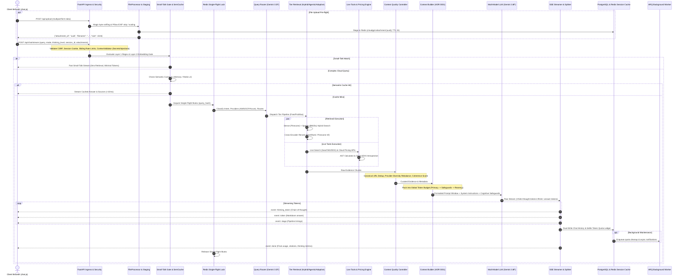
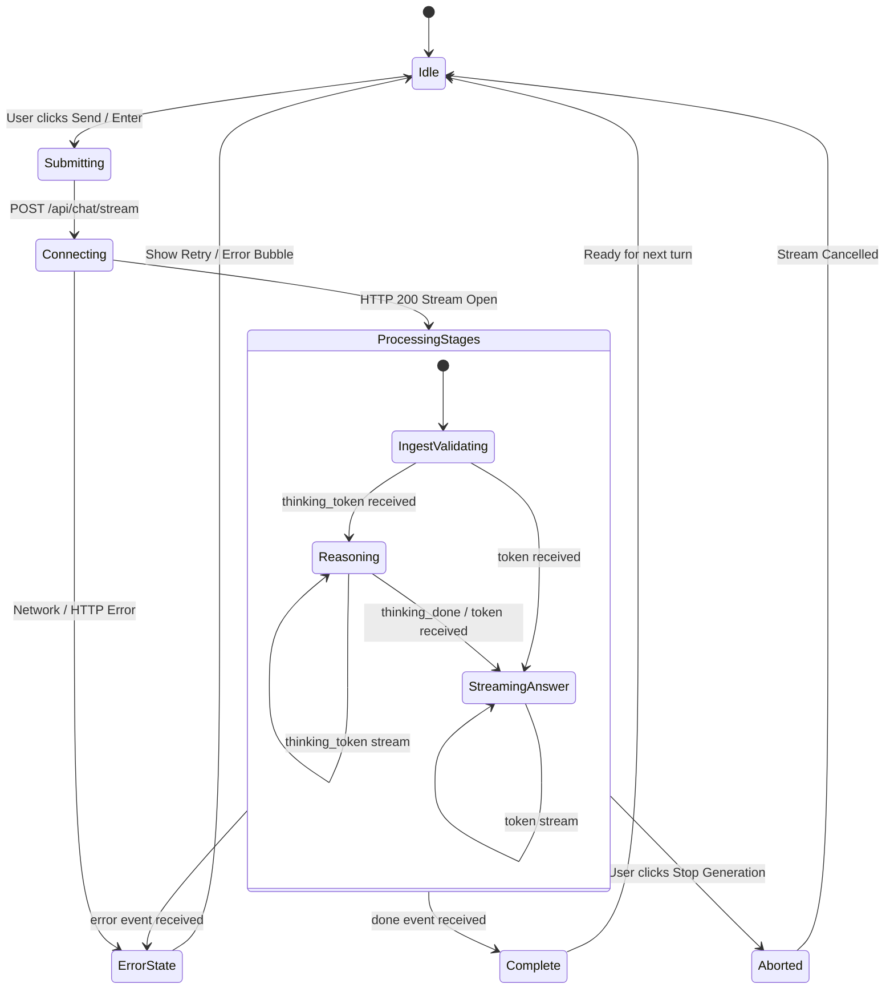
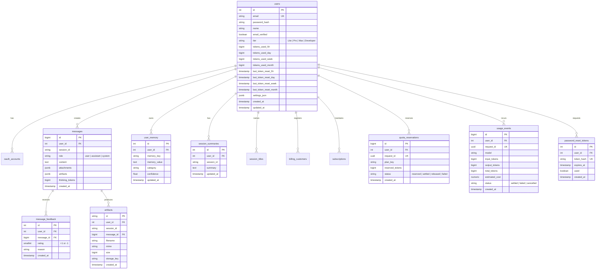
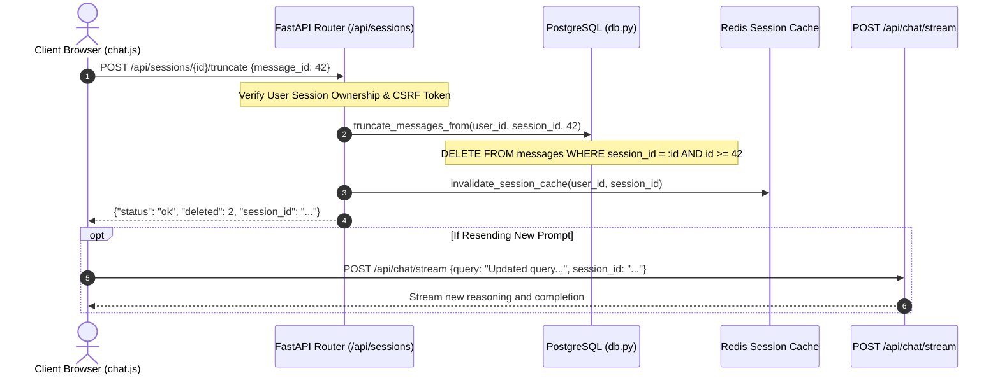

# CloudGPT — Comprehensive System Design Blueprint

**Document Version:** 2026-09 (Enterprise Multi-Model Cloud Intelligence, Multimodal I/O, Cognitive Safeguards & Interactive Message Actions)  
**Status:** Approved & Production-Ready  
**Classification:** Senior Staff / Principal Architecture Specification  

---

## 1. End-to-End Request/Response Lifecycle

CloudGPT coordinates synchronous API calls, multi-stage retrieval, reasoning engines, and asynchronous streaming via a unified pipeline entry point: `api/chat_routes.py:execute_agent_pipeline`.

### 1.1 Complete Sequence Diagram



### 1.2 Execution Phase Breakdown
1. **HTTP Handshake & Ingress Sanitization**: The browser initiates an HTTP `POST` to `/api/chat/stream`. `SecurityHeadersMiddleware` verifies headers, `CSRFMiddleware` validates `X-CSRF-Token`, and `core/rate_limit.py` tracks the sliding-window budget.
2. **Deterministic Context Validation**: `ContextValidator` inspects the raw user query and file attachments for prompt injection vectors and scrubs any embedded cloud credentials (AWS `AKIA`, GCP service account keys, connection strings) before passing the input downstream.
3. **Multi-Stage Gating**:
   - **Layer 1 Regex Gate**: Checks for immediate social matches (`"hello"`, `"thank you"`). If detected, it circumvents retrieval entirely.
   - **Layer 2 Embedding Cosine Gate**: Computes cosine similarity of query embedding against canonical greetings via `BAAI/bge-small-en-v1.5`.
   - **Semantic Cache Check**: If cosine similarity against a cached query embedding exceeds intent-specific thresholds (e.g., 0.95 for pricing, 0.90 for conceptual), the cached answer is streamed immediately.
4. **Single-Flight Lock**: To prevent cache stampedes and duplicated LLM costs when multiple clients submit identical queries simultaneously, a distributed Redis mutex (`single_flight_lock:{query_hash}`) ensures only one pipeline execution proceeds; subsequent requests wait and stream the produced response.
5. **Router & Gating**: Query classification extracts cloud providers (`aws`, `gcp`, `azure`), target services, and operational routes (`RAG`, `PRICING`, `CALCULATOR`, `WEB`).
6. **Tier-Specialized Retrieval Execution**: Dispatches to Free (Direct RAG), Pro (Agentic RAG with evidence grading), or Max (Adaptive RAG with HyDE and Live Verify).
7. **Context Quality Control (CQC)**: URL deduplication, provider balance checks, and contradiction analysis.
8. **Context Assembly & Cognitive Safeguards (ADR 0001)**: Enforces global token budgets (`TokenBudget`), placing security guardrails at the top (primacy), cognitive reasoning safeguards in the instruction block, and the user query at the bottom (recency).
9. **LLM Inference & Stream Splitting**: `GeminiProvider` streams output tokens. `ThinkingStreamSplitter` separates thoughts (`<think>...</think>`) into `thinking_token` SSE events and the response into `token` events.
10. **Persistence & Dual-Write**: Persists messages to PostgreSQL while updating the active Redis session cache for fast multi-turn retrieval.

---

## 2. Server-Sent Events (SSE) Protocol Contract & State Machine

CloudGPT delivers real-time updates over HTTP SSE (`Content-Type: text/event-stream; charset=utf-8`).

### 2.1 Event Schema Catalog

| Event Name | Schema Payload | Description |
|---|---|---|
| `status` | `{"status": "Searching documentation..."}` | Human-readable user progress notification |
| `stage` | `{"stage": "retrieval", "label": "Hybrid RAG", "stage_status": "start"\|"complete", "elapsed_ms": 145.2}` | Structured pipeline stage timing event |
| `provider_detected` | `{"provider": "aws"\|"gcp"\|"azure"\|"multi"}` | Primary detected cloud provider |
| `session_title` | `{"title": "AWS S3 Lifecycle Automation", "session_id": "uuid"}` | Asynchronously generated chat topic title |
| `thinking_token` | `{"thinking_token": "Evaluating cross-region replication..."}` | Streamed chain-of-thought token |
| `thinking_done` | `{"elapsed": 3.42}` | Signals completion of reasoning phase |
| `token` | `{"token": "## Architecture Overview\n"}` | Streamed response markdown token |
| `memory_updated` | `{"key": "primary_cloud", "value": "AWS"}` | Emitted when user preference fact is saved |
| `live_verify` | `{"status": "start"\|"complete", "query": "S3 glacier flexible retrieval pricing"}` | Live documentation verification escalation |
| `error` | `{"error": "Quota Exceeded", "detail": "Daily token limit reached", "quota_exceeded": true}` | Actionable error notification |
| `done` | `{"answer": str, "sources": list, "usage": dict, "model_used": str, "thinking": dict}` | Final terminal payload |

### 2.2 Client State Machine (`static/js/chat.js`)



### 2.3 Terminal Payload Contract (`done` event)
```json
{
  "answer": "To configure S3 Cross-Region Replication...",
  "sources": [
    {
      "source_number": 1,
      "source_type": "rag",
      "url": "https://docs.aws.amazon.com/AmazonS3/latest/userguide/replication.html",
      "provider": "aws",
      "service": "s3",
      "title": "Replicating objects - Amazon Simple Storage Service",
      "section": "Replication configuration"
    }
  ],
  "usage": {
    "prompt_tokens": 3420,
    "completion_tokens": 680,
    "thinking_tokens": 1240,
    "total_tokens": 5340,
    "estimated_cost_usd": 0.00642
  },
  "model_used": "gemini-3.8-flash",
  "thinking": {
    "level": "Medium",
    "budget": 8192,
    "tokens": 1240,
    "elapsed": 2.85
  },
  "pipeline_timings": {
    "classification": 120.4,
    "retrieval": 215.1,
    "reranking": 180.6,
    "context_assembly": 22.0,
    "llm_generation": 2840.5
  }
}
```

---

## 3. Tier Execution Algorithms & State Machines

### 3.1 Free / Lite Tier Algorithm (Direct RAG)
```python
async def run_free_rag_pipeline(query, chat_history, emit_event):
    # 1. Hybrid Retrieval (Top 50)
    dense_hits = await dense_retriever.retrieve(query, top_k=50)
    sparse_hits = await sparse_retriever.retrieve(query, top_k=50)
    combined_hits = reciprocal_rank_fusion(dense_hits, sparse_hits, w_dense=0.7, w_sparse=0.3)
    
    # 2. Local Cross-Encoder Rerank (Top 10)
    reranked = reranker.rerank(query, combined_hits, top_k=10)
    
    # 3. Context Builder with Cognitive Safeguards (Max 4,000 prompt tokens / 3,000 RAG context)
    budget = TokenBudget(total_budget=4000)
    packed_context = context_builder.build_context(query, reranked, chat_history, budget, tier="Free")
    
    # 4. LLM Generation (Low thinking budget: 2,048 tokens)
    provider = get_llm_provider("main", tier="Free")
    async for token in provider.generate_stream(packed_context, thinking_level="Low"):
        yield token
```

### 3.2 Pro / Core Tier Algorithm (Agentic RAG)
```python
async def run_agentic_rag_pipeline(query, chat_history, emit_event):
    # Stage 1: Plan & Route (Gemini 3.5 Flash Sub-Model)
    emit_event(stage="plan_route", status="start")
    plan = await sub_model.classify(query, system_prompt=AGENTIC_PLAN_PROMPT)
    emit_event(stage="plan_route", status="complete")
    
    # Stage 2: Parallel Multi-Hop Fan-Out & Web Search
    emit_event(stage="agentic_retrieve", status="start")
    retrieval_tasks = [hybrid_retriever.retrieve(sq) for sq in plan.sub_queries]
    if plan.needs_internet:
        retrieval_tasks.append(web_search.search(query))
    raw_results = await asyncio.gather(*retrieval_tasks)
    emit_event(stage="agentic_retrieve", status="complete")
    
    # Stage 3: Evidence Grading Loop
    emit_event(stage="grade_evidence", status="start")
    graded_chunks, avg_score = await grade_evidence(sub_model, raw_results, query)
    emit_event(stage="grade_evidence", status="complete")
    
    # Stage 4: Conditional Self-Critique / Answer Evaluator
    context = context_builder.build_context(query, graded_chunks, budget=TokenBudget(7000), tier="Pro")
    if avg_score < 0.70:
        emit_event(stage="agentic_critique", status="start")
        # Run isolated evaluator (Gemini 3.7 Flash, temp=0.1) to eliminate hallucinations
        evaluator = get_evaluator_provider(tier="Pro")
        critique = await evaluator.generate(context)
        context.append({"role": "system", "content": f"Self-Correction Guidance: {critique}"})
        emit_event(stage="agentic_critique", status="complete")
        
    # Stage 5: Generation with Medium Thinking Budget (8,192 tokens)
    async for token in main_llm.generate_stream(context, thinking_level="Medium"):
        yield token
```

### 3.3 Max / Apex Tier Algorithm (Adaptive Advanced RAG)
```python
async def run_adaptive_rag_pipeline(query, chat_history, emit_event):
    # Stage 1: Query Transformation (Rewrite, Multi-Perspective Expansion, HyDE)
    emit_event(stage="transform_query", status="start")
    transform = await sub_model.classify(query, system_prompt=QUERY_TRANSFORM_PROMPT)
    hyde_embedding = await embedding_engine.embed_query(transform.hyde_passage)
    emit_event(stage="transform_query", status="complete")
    
    # Stage 2: Multi-Query Dense + HyDE Parallel Retrieval
    emit_event(stage="adaptive_retrieve", status="start")
    candidates = await parallel_multi_vector_search(transform.expanded_queries, hyde_embedding)
    emit_event(stage="adaptive_retrieve", status="complete")
    
    # Stage 3: Rerank & Sentence-Level Context Compression
    emit_event(stage="rerank_compress", status="start")
    reranked = reranker.rerank(query, candidates, top_k=15)
    compressed_chunks = sentence_level_compress(reranked, query, threshold=0.60)
    emit_event(stage="rerank_compress", status="complete")
    
    # Stage 4: Live Verify Escalation Gate
    stale_chunks = [c for c in compressed_chunks if is_stale(c, days=90)]
    if stale_chunks or calculate_confidence(reranked) < 0.45:
        emit_event(stage="live_verify", status="start")
        live_docs = await live_verify_search(query, target_domains=get_provider_domains(query))
        compressed_chunks = live_docs + compressed_chunks
        emit_event(stage="live_verify", status="complete")
        
    # Stage 5: CQC & Max Token Budget Assembly with Cognitive Safeguards (12,000 tokens)
    curated = context_quality_controller.curate(compressed_chunks)
    context = context_builder.build_context(query, curated, budget=TokenBudget(12000), tier="Max")
    
    # Stage 6: Generation with High/Max Thinking Budget (24,576 - 65,535 tokens)
    async for token in main_llm.generate_stream(context, thinking_level=chosen_level):
        yield token
```

---

## 4. Caching Hierarchy & Key Topology

CloudGPT operates a multi-level caching hierarchy designed to achieve sub-millisecond responses on repeated queries while preventing cache stampedes.

```
┌────────────────────────────────────────────────────────────────────────────────────────┐
│                              CACHE LOOKUP FLOW                                         │
└────────────────────────────────────────────────────────────────────────────────────────┘
                                    Query Ingress
                                          │
                                          ▼
                         ┌─────────────────────────────────┐
                         │ L1 In-Memory LRU Cache          │
                         │ Key: sha256(canonical_query)    │
                         └──────────────┬──────────────────┘
                                        ├── Hit ──► Return In-Memory Result (< 1ms)
                                        └── Miss
                                             ▼
                         ┌─────────────────────────────────┐
                         │ Semantic Similarity Cache       │
                         │ Vector Cosine Sim >= Threshold? │
                         └──────────────┬──────────────────┘
                                        ├── Hit ──► Stream Cached Payload (< 10ms)
                                        └── Miss
                                             ▼
                         ┌─────────────────────────────────┐
                         │ L2 Redis Response Cache         │
                         │ Key: llm_resp:{v_corpus}:{hash} │
                         └──────────────┬──────────────────┘
                                        ├── Hit ──► Warm L1 & Stream Result (< 5ms)
                                        └── Miss
                                             ▼
                         ┌─────────────────────────────────┐
                         │ Full Agent Pipeline Execution   │
                         │ Write Back to L1, SemCache, L2  │
                         └─────────────────────────────────┘
```

### 4.1 Cache Key Registry & Invalidation Rules

| Cache Layer | Redis Key Pattern | TTL | Invalidation Trigger |
|---|---|---|---|
| **Session History** | `session_history:{user_id}:{session_id}` | 7,200s (2h) | Append turn, Clear Chat, Truncate, Logout |
| **LLM Response** | `llm_resp:{corpus_v}:{prompt_v}:{provider}:{hash}` | 86,400s (24h) | Corpus version bump (`cache_corpus_version`), Prompt edit |
| **Retrieval Cache** | `retrieval:{corpus_v}:{ns}:{hash}` | 3,600s (1h) | Pinecone index update, Ingestion sync |
| **Tool & Pricing** | `tool:pricing:{provider}:{service}:{hash}` | 3,600s (1h) | Pricing API schema update |
| **Web Search Cache**| `tool:web_search:{param_hash}` | 3,600s (1h) | Param hash expiration |
| **User Memory** | `user_mem:{user_id}` | 86,400s (24h) | Memory fact upsert/deletion in Settings UI |
| **Single-Flight Lock** | `single_flight_lock:{query_hash}` | 45s (auto-expire) | Pipeline completion |
| **Staged Attachment** | `cloudgpt:attachment:{attachment_id}` | 3,600s (1h) | Time to live expiration |
| **Staged Artifact** | `cloudgpt:artifact:{storage_key}` | 86,400s (24h) | Time to live expiration |

---

## 5. Relational Data Models & Database Schema

CloudGPT stores durable relational data in PostgreSQL using 13 applied migrations. All access runs through `db.py` using `psycopg2.pool.SimpleConnectionPool`.



---

## 6. Interactive Message Actions & Turn Truncation Architecture

CloudGPT provides native support for turn truncation (`/api/sessions/{session_id}/truncate`), enabling both inline prompt editing and instant turn rollback:



---

## 7. Concurrency, Locks & Throttling Blueprint

### 7.1 Single-Flight Request Coalescing (`core/llm_cache.py:single_flight_lock`)
When multiple identical requests arrive simultaneously (common during live demos or automated scripts), CloudGPT prevents redundant LLM billing and retrieval contention:
1. Calculates `query_hash = sha256(canonical_query + provider_filter + tier)`.
2. Attempts to acquire a non-blocking Redis lock `SET single_flight_lock:{hash} {request_id} NX EX 45`.
3. If acquired, the worker executes the pipeline and populates the cache.
4. If another worker holds the lock, the current request polls `get_cached_answer()` in non-blocking 500ms increments up to 30 seconds. As soon as the leader finishes and populates Redis, the follower returns the cached answer without calling the LLM.

### 7.2 Sliding-Window Rate Limiting Implementation
- Uses Redis sorted sets (`ZSET`): `key = rate_limit:{scope}:{user_or_ip}`.
- Algorithm:
  1. `ZREMRANGEBYSCORE key 0 (current_timestamp - window_size)`.
  2. `ZCARD key` to count requests within the active window.
  3. If count `< limit`, `ZADD key current_timestamp request_uuid` and proceed.
  4. If count `>= limit`, return HTTP 429 with `Retry-After` header.

---

## 8. Fault Tolerance, Resiliency & Degradation Matrix

CloudGPT is engineered to maintain service continuity during partial infrastructure outages:

| Component / Subsystem | Failure Scenario | Degradation & Recovery Strategy | Policy |
|---|---|---|---|
| **Redis Cache** | Process crash, network partition, connection refused | Gracefully fall back to in-process memory cache (`MemoryCache`) and local Python dictionaries. Dual-write skips Redis without failing DB writes. | **Fail-Open** |
| **Pinecone Vector DB** | HTTP 503, API timeout, dimension mismatch | Hybrid retriever immediately falls back to sparse BM25s lexical search. Increments `cloudgpt_rag_fallback_total`. | **Fail-Open** |
| **FlashRank Reranker** | Model unreadable, CPU out of memory | Returns raw RRF-fused results in ranked order. Omits reranking step. | **Fail-Open** |
| **SearXNG Search** | Service timeout, zero search results | Falls back to DuckDuckGo HTML scraping. If all search providers fail, proceeds with internal RAG corpus only. | **Fail-Open** |
| **Gemini Overload (503/504)**| High demand, transient cluster failure | Automatically walks fallback cascade (3.8F → 3.7F → 3.6F → 3.5F → 3.5F-Lite). Trips 300s circuit breaker cooldown on failed model. | **Graceful Cascade** |
| **Gemini Quota Limit (429)** | Free tier quota exhausted (`RESOURCE_EXHAUSTED`)| Throws `GeminiQuotaExceeded`. Bypasses the fallback chain immediately because all models share one project API key. Returns clear upgrade CTA. | **Fail-Fast** |
| **PostgreSQL Pool** | Connection pool exhausted (`max=30`) | Connection requests wait up to 5s before raising a 503 Service Unavailable error. Read operations fall back to Redis session cache. | **Fail-Safe** |
| **Context Validator** | Prompt injection attack detected | If `context_validator_fail_closed=True`, rejects request with HTTP 400. If credentials detected, scrubs with `[REDACTED]` and proceeds. | **Fail-Closed (Injection) / Scrub (Secrets)** |
| **ARQ Worker Offline** | Worker process crashed | API enqueues tasks to Redis queue; tasks persist until worker restarts. Non-critical jobs skip execution without impacting user streams. | **Graceful Queueing** |

---

## 9. Latency Budgets & SLA Allocations

CloudGPT maintains strict latency boundaries across every stage of the pipeline:

### 9.1 Per-Stage Latency Budgets (`api/chat_routes.py:LatencyBudget`)
- **Query Classification & Routing**: $\le$ 300 ms (Sub-model Gemini 3.5 Flash)
- **Hybrid Retrieval (Dense + Sparse)**: $\le$ 300 ms (Pinecone dotproduct + BM25s)
- **Cross-Encoder Reranking**: $\le$ 400 ms (FlashRank 12-layer MiniLM)
- **Web Search & Provider Scraping**: $\le$ 2,000 ms (SearXNG with timeout)
- **Context Assembly & Token Budgeting**: $\le$ 50 ms (TokenBudget packing)
- **Time-to-First-Token (TTFT)**: $\le$ 1,500 ms (Excluding reasoning phase)
- **Total Pipeline Deadline**: $\le$ 25,000 ms (Maximum client timeout before abort)

### 9.2 Service Level Objectives (SLOs)
| Request Type | p50 Latency | p95 Latency | p99 Latency | Target Availability |
|---|---|---|---|---|
| **Small-Talk / Social Bypass** | 12 ms | 35 ms | 85 ms | 99.99% |
| **Semantic Cache Hit** | 18 ms | 45 ms | 110 ms | 99.95% |
| **Free Tier Standard RAG** | 1,800 ms | 3,200 ms | 5,500 ms | 99.90% |
| **Pro Tier Agentic RAG** | 3,400 ms | 6,800 ms | 9,800 ms | 99.85% |
| **Max Tier Adaptive Reasoning** | 4,200 ms | 9,500 ms | 14,500 ms | 99.80% |
