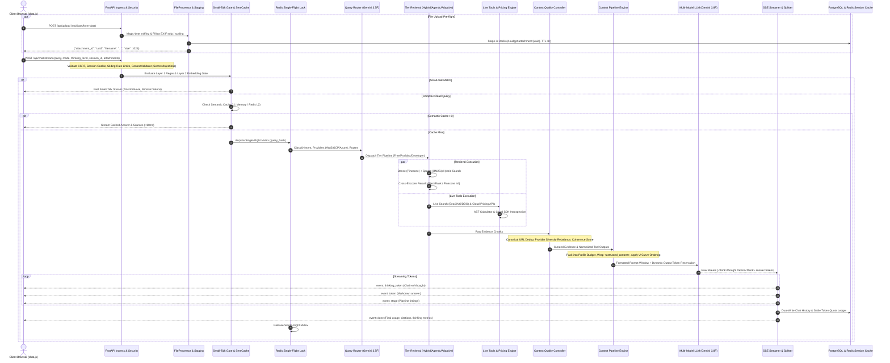
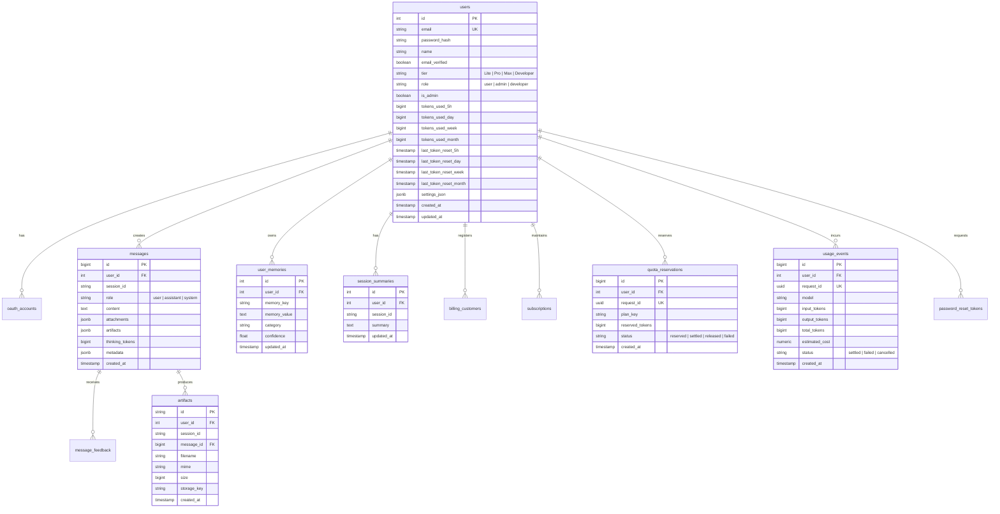

# CloudGPT — Comprehensive System Design Blueprint

**Document Version:** 2026-09 (Enterprise Multi-Model Cloud Intelligence, Enterprise Context Engine, Multimodal I/O, Cognitive Safeguards & Complete File-by-File Blueprint)  
**Status:** Approved & Production-Ready  
**Classification:** Senior Staff / Principal Architecture Specification  
**Repository Path:** `C:\CloudGPT`  

---

## 1. System Design Principles & Domain Contracts

CloudGPT is designed according to core enterprise systems engineering principles:
1. **Deterministic Context Quality Over Unbounded Window Growth**: Rather than naively packing context up to raw LLM token limits, CloudGPT enforces strict, declarative context profiles (Lite: 8K, Pro: 32K, Max: 64K, Developer: 128K) that prioritize the most relevant evidence, normalize tool payloads, encapsulate untrusted data in `<untrusted_content>` tags, and order evidence according to empirical U-curve attention distributions.
2. **Fail-Open Resilience for Dependent Subsystems**: If Redis, Pinecone, SearXNG, or the FlashRank reranker fail or experience transient network timeouts, the pipeline never crashes. It gracefully degrades to in-process LRU memory caching, sparse BM25s lexical search, DuckDuckGo web scraping, or raw RRF scores.
3. **Fail-Fast for Exhausted Quotas**: When project-level API key limits or user-tier quotas are reached (`RESOURCE_EXHAUSTED` / HTTP 429), the system immediately terminates execution rather than walking pointless model fallback cascades, saving latency and providing transparent user notifications.
4. **Strict Additive Evolution of the Frontend Contract**: The SSE streaming protocol (`/api/chat/stream`) evolves only through new event types (`stage`, `thinking_token`, `thinking_done`, `memory_updated`, `live_verify`). Existing event shapes remain strictly backward-compatible.
5. **Single Upload Funnel**: Every user-provided file enters through `POST /api/upload`, undergoing magic-byte content sniffing, Pillow image sanitization, runaway text extraction guards, and Redis staging under a 1-hour TTL.

---

## 2. Complete File-by-File Technical Blueprint

Every folder and file in `C:\CloudGPT` serves a dedicated, modular responsibility. Below is the comprehensive architectural and component-level specification.

### 2.1 Root Application Entrypoints & Core Modules

#### `app.py`
- **Role**: Application factory, Lifespan context manager, HTTP middleware stack, and HTML page router.
- **Key Functions & Classes**:
  - `lifespan(app: FastAPI)`: Asynchronous context manager initializing connection pools, verifying Redis readiness, warming up in-memory caches, and closing connections on shutdown.
  - `SecurityHeadersMiddleware`: Adds security headers (`X-Content-Type-Options`, `X-Frame-Options`, `Content-Security-Policy`).
  - `CSRFMiddleware`: Intercepts mutating HTTP requests (`POST`, `PUT`, `DELETE`), validating `X-CSRF-Token` headers.
  - Page routes: `/` (landing), `/chat` (workspace), `/login`, `/signup`, `/pricing`, `/billing`, `/terms`, `/privacy`, `/admin`.
  - Google OAuth routes: `/auth/google`, `/auth/google/callback` utilizing `authlib`.
  - Health & Telemetry probes: `/healthz` (liveness), `/readyz` (readiness with DB and Pinecone dimension checks), `/api/health`, `/metrics` (Prometheus exposition).

#### `config.py`
- **Role**: Single source of truth for configuration using Pydantic `BaseSettings` (`SettingsConfigDict(env_file=".env")`).
- **Key Parameters**:
  - Database: `database_url`, `db_pool_min_conn=2`, `db_pool_max_conn=30`.
  - Redis: `redis_url`, `redis_enabled=True`, `redis_cache_ttl_seconds=86400`, `redis_session_ttl_seconds=7200`, `redis_tool_ttl_seconds=3600`.
  - Auth & Security: `secret_key`, `jwt_algorithm="HS256"`, `jwt_access_token_expire_minutes=60`, `google_client_id`, `google_client_secret`.
  - Multi-Tier Quotas: `lite_tokens_day`, `lite_tokens_month`, `pro_tokens_day`, `pro_tokens_month`, `max_tokens_day`, `max_tokens_month`.
  - Context Engine Ceilings: `context_token_ceiling_lite=8192`, `context_token_ceiling_agentic=32768`, `context_token_ceiling_adaptive=65536`, `context_token_ceiling_developer=128000`.
  - Developer Tier Bypass: `enable_developer_unlimited_bypass=True`, `developer_emails`.
  - Model Selection: `default_model="gemini-2.5-flash"`, `gemini_api_key`, `pinecone_api_key`, `searxng_url`.

#### `db.py`
- **Role**: Centralized PostgreSQL database access layer using synchronous `psycopg2` and `ThreadedConnectionPool`.
- **Key Functions & Classes**:
  - `QuotaExceeded`, `DatabaseUnavailableError`: Specialized exception types.
  - `get_pool()`, `get_connection()`, `put_connection(conn)`: Connection pool context lifecycle management with `statement_timeout=30000`.
  - User Management: `get_user_by_id(id)`, `get_user_by_email(email)`, `create_user(...)`, `update_user_tier(id, tier)`, `update_user_role(id, role)`, `update_user_settings(id, settings)`.
  - Chat Sessions: `create_session(...)`, `get_session(...)`, `list_user_sessions(user_id)`, `delete_session(...)`, `truncate_messages_from(user_id, session_id, message_id)`.
  - Messages: `create_message(session_id, role, content, attachments, artifacts, thinking_tokens, metadata)`, `get_messages_for_session(...)`.
  - Quotas: `reserve_usage(user_id, request_id, entitlements, amount)`, `settle_usage(...)`, `release_reservation(...)`, `get_token_usage(user_id)`.
  - Durable User Memory: `save_user_memory(user_id, key, value, category, confidence)`, `get_user_memories(user_id)`, `delete_user_memory(user_id, key)`.
  - Artifacts: `save_artifact(...)`, `get_artifact(...)`, `list_session_artifacts(...)`.

#### `admin_routes.py`
- **Role**: Administrative control plane mounted at `/admin` and `/api/admin`.
- **Key Endpoints**:
  - `GET /api/admin/users`: Paginated user list with role, tier, and token consumption filters.
  - `GET /api/admin/users/{user_id}`: Deep inspection of user subscription, active reservations, and recent sessions.
  - `POST /api/admin/users/{user_id}/tier`: Administrative tier override (e.g. promoting accounts to Developer or Max).
  - `POST /api/admin/cache/purge`: Administrative cache clearing for LLM, semantic, or session caches.
  - `GET /api/admin/stats`: Aggregated platform statistics, active connections, and token expenditure.

#### `file_processor.py`
- **Role**: Upload validation, magic-byte MIME sniffing, text extraction, and image preprocessing.
- **Key Constants & Functions**:
  - `_MAGIC_SIGNATURES`: Binary header tuples (`%PDF-`, `PK\x03\x04`, `\x89PNG`, `\xff\xd8\xff`, `RIFF...WAVE`, `ID3`).
  - `_MAX_EXTRACTED_CHARS = 200_000`: Decompression-bomb and runaway-text guard.
  - `validate_upload(...)`: Validates file size against tier limits, verifies magic bytes, extracts plain text from TXT, MD, CSV, PDF (PyPDF2), DOCX, XLSX, and source code.
  - Pillow image sanitization: Strips EXIF metadata, resizes dimensions to $\le 2048 \times 2048$, and normalizes color formats.
  - `stage_attachment(...)`: Caches extracted text and raw data in Redis (`cloudgpt:attachment:{uuid}`) with a 1-hour TTL.

#### `email_service.py`
- **Role**: Transactional email delivery service using `aiosmtplib` and `smtplib`.
- **Key Functions**:
  - `send_email(to, subject, html_body, text_body)`: Dispatches emails via configured SMTP credentials.
  - Templates for email verification tokens, password reset links, and quota exhaustion warnings.

#### `metrics.py`
- **Role**: Prometheus metrics registry and instrumentation definitions.
- **Key Metrics**:
  - `CHAT_REQUESTS_TOTAL = Counter("cloudgpt_chat_requests_total", ...)`
  - `RAG_STAGE_DURATION_SECONDS = Histogram("cloudgpt_rag_stage_duration_seconds", ...)`
  - `TTFT_SECONDS = Histogram("cloudgpt_ttft_seconds", ...)`
  - `CACHE_HITS_TOTAL`, `CACHE_MISSES_TOTAL`, `SEMANTIC_CACHE_HITS`
  - `TOKEN_USAGE_TOTAL = Counter("cloudgpt_token_usage_total", ...)`
  - `LLM_QUOTA_ERRORS_TOTAL = Counter("cloudgpt_llm_quota_errors_total", ...)`
  - `DB_POOL_EXHAUSTED_TOTAL = Counter("cloudgpt_db_pool_exhausted_total", ...)`

#### `logging_config.py`
- **Role**: Structured logging configuration using `structlog` and standard Python `logging`.
- **Features**: Outputs JSON-formatted logs in production, redacting sensitive tokens, and automatically binding contextual fields (`request_id`, `user_id`, `session_id`).

#### `tasks.py` & `worker.py`
- **Role**: ARQ background task queue worker definitions and runner.
- **Key Tasks**:
  - `cleanup_expired_reservations_task(ctx, ttl_minutes=10)`: Scheduled cron job clearing stale token reservations.
  - `send_email_task(ctx, to, subject, html_body)`: Background email delivery decoupled from web requests.
  - `ingest_services_task(ctx)`: Admin-triggered background re-indexing of the cloud services corpus.

#### `init_db.py` & `migrate.py`
- **Role**: Database initialization and versioned migration runner.
- **Features**: Inspects applied migrations in the `schema_migrations` table, executing unapplied SQL files from `migrations/` in numerical sequence.

---

### 2.2 `api/` — Route Controllers & Pipelines

#### `api/chat_routes.py`
- **Role**: The core pipeline coordinator for both streaming and non-streaming chat requests.
- **Key Functions & Classes**:
  - `ChatRequest`, `ChatResponse`, `SourceCitation`: Pydantic input/output contracts.
  - `LazyServices`: Singleton service container instantiating LLM providers, retrievers, and embedding engines on demand.
  - `execute_agent_pipeline(...)`: The master orchestrator:
    1. Evaluates exact-hash cache and semantic similarity cache.
    2. Acquires distributed single-flight lock (`single_flight_lock:{query_hash}`).
    3. Runs small-talk gate and query router classification.
    4. Gathers context concurrently (`_gather_pipeline_context`): Hybrid RAG, SearXNG web search, Cloud Pricing APIs, AST Calculator.
    5. Applies Context Quality Controller (CQC) deduplication and provider rebalancing.
    6. Builds prompt via `ContextPipelineEngine` enforcing profile ceilings, `<untrusted_content>` encapsulation, and evidence ordering.
    7. Invokes multi-model LLM generation loop with fallback cascade and thinking stream splitting.
    8. Verifies citations and executes dual-write persistence to PostgreSQL and Redis.
  - `POST /api/chat/stream`: SSE streaming endpoint yielding `status`, `stage`, `provider_detected`, `session_title`, `thinking_token`, `thinking_done`, `token`, `memory_updated`, `error`, and `done` events.
  - `POST /api/chat`: Non-streaming endpoint returning full `ChatResponse`.
  - `POST /api/upload`: Hardened file upload endpoint.
  - `GET /api/attachments/{attachment_id}`: Attachment download endpoint.
  - `POST /api/chat/feedback`: Message rating (+1 / -1) and feedback tracking.
  - `POST /api/sessions/{session_id}/truncate`: Message history rollback and prompt edit endpoint.

#### `api/billing_routes.py`
- **Role**: Stripe and Razorpay payment integrations and webhook handlers.
- **Key Endpoints**:
  - `POST /api/billing/checkout`: Creates Stripe Checkout Session or Razorpay Order for Pro/Max plans.
  - `POST /api/billing/portal`: Generates Stripe Customer Portal session URL.
  - `POST /api/billing/webhook/stripe`: Processes `checkout.session.completed`, `customer.subscription.updated`, and `customer.subscription.deleted`.
  - `POST /api/billing/verify/razorpay`: Verifies Razorpay payment signatures using HMAC-SHA256.

#### `api/artifacts.py`
- **Role**: Interactive workspace artifact storage, versioning, and download manager.
- **Key Endpoints**:
  - `POST /api/artifacts`: Saves new artifact (code snippet, Terraform file, markdown report).
  - `GET /api/artifacts/{id}`: Retrieves artifact content and metadata.
  - `GET /api/artifacts/{id}/download`: Downloads artifact with `Content-Disposition: attachment`.

---

### 2.3 `core/` — Core Infrastructure, Caching & Security

#### `core/entitlements.py`
- **Role**: Authority for user plan capabilities, quotas, thinking limits, and Developer tier overrides.
- **Key Classes & Functions**:
  - `Entitlements`: Immutable dataclass representing plan features (`plan_key`, `model_tier`, `tokens_day`, `tokens_month`, `max_file_bytes`, `allowed_models`, `allowed_thinking_levels`).
  - `resolve_entitlements(...)`: Resolves trusted entitlements from user and subscription records.
  - **Developer Tier**: Configures unlimited token quotas (`tokens_day=None`), access to all models (`Lite`, `Core`, `Apex`), all thinking levels (`Low` to `Max`), and rate-limit exemption.

#### `core/security.py`
- **Role**: Cryptographic operations, password hashing, JWT generation, and security middlewares.
- **Key Functions & Classes**:
  - `CSRFMiddleware`: Enforces `X-CSRF-Token` validation on mutating requests.
  - `SecurityHeadersMiddleware`: Injects standard OWASP security headers.
  - Password management: `bcrypt.hashpw` and `bcrypt.checkpw`.
  - JWT Tokens: `create_access_token(...)`, `decode_access_token(...)` using `python-jose`.

#### `core/rate_limit.py`
- **Role**: Sliding-window rate limiter using Redis sorted sets with graceful in-memory fallback.
- **Key Class**: `SlidingWindowRateLimiter`.

#### `core/redis_client.py`
- **Role**: Async Redis manager with automatic reconnection, connection pooling, and in-memory fallback mode.
- **Key Class**: `RedisManager`.

#### `core/session_cache.py`
- **Role**: Multi-turn chat session working memory and dual-write synchronizer.
- **Key Functions**:
  - `get_fast_chat_history(user_id, session_id)`: Fetches recent turns directly from Redis list (`session_history:{user_id}:{session_id}`).
  - `record_message_dual_write(...)`: Simultaneously writes completed assistant turns to PostgreSQL and Redis.
  - `invalidate_session_cache(...)`: Flushes Redis session list upon message deletion or rollback.

#### `core/semantic_cache.py`
- **Role**: Embedding-based semantic similarity cache for queries.
- **Key Class**: `SemanticCache`. Calculates cosine similarity of query embeddings against cached vector keys, returning responses in $<10\text{ ms}$ on hits exceeding intent-specific thresholds (0.95 for pricing, 0.88 for conceptual).

#### `core/tool_cache.py` & `core/llm_cache.py`
- **Role**: Caching layers for external tool executions and raw LLM completions.
- **Key Functions**:
  - `get_cached_llm_response(...)` / `set_cached_llm_response(...)`.
  - `single_flight_lock(...)`: Distributed Redis mutex preventing cache stampedes.

#### `core/user_memory.py`
- **Role**: Cross-session durable user preferences extraction and persistence.
- **Key Functions**:
  - `extract_durable_user_facts(query, response)`: Uses lightweight sub-model to extract persistent architectural facts (e.g., `"Primary cloud: AWS"`, `"Prefers Terraform"`).
  - `save_user_memory(...)` / `get_user_memories_cached(...)`.

#### `core/context_validator.py`
- **Role**: Zero-LLM security validator scanning for prompt injections, secret credentials, and chunk staleness.
- **Key Class**: `ContextValidator`.

#### `core/context_quality.py`
- **Role**: Context Quality Controller (CQC).
- **Key Class**: `ContextQualityController`. Performs URL canonicalization, content-hash deduplication, multi-cloud provider rebalancing, and contradiction scoring.

---

### 2.4 `llm/` — Multi-Model Providers & Enterprise Context Engine

#### `llm/context_builder.py`
- **Role**: Core orchestrator of the Enterprise Context Engine.
- **Key Classes**:
  - `ContextPipelineEngine`: Builds prompt windows based on declarative `ContextProfile` specifications. Enforces primacy guardrails, user memory injection, rolling history compaction, normalized tool outputs, `<untrusted_content>` safety wrapping, evidence ordering, and recency reinforcement.
  - `ContextBuilder`: Backward-compatible wrapper preserving legacy `build_context()` signatures while delegating to `ContextPipelineEngine`.
  - `LiteContextEngine`, `AgenticContextEngine`, `AdaptiveContextEngine`: Profile-specialized engines.

#### `llm/context_types.py`
- **Role**: Strongly typed data structures for the Enterprise Context Engine.
- **Key Classes**:
  - `ContextProfile`: Dataclass defining ceilings, evidence budgets, history budgets, ordering strategies, and safety boundaries.
  - `ContextBuildResult`: Returned structured context object containing the formatted prompt, metadata, provenance records, and token statistics.
  - `WorkingMemoryState`: Structured multi-turn state container kept outside the prompt.
  - `ProvenanceRecord`: First-class context primitive tracking chunk ID, URL, provider, service, score, and placement.
  - `OrderingStrategy`: Enum (`U_CURVE`, `SCORE_DESCENDING`, `COHERENCE_PRESERVING`, `ADAPTIVE`).

#### `llm/context_safety.py`
- **Role**: Prompt injection defense and untrusted context encapsulation.
- **Key Class**: `ContextSafetyGuard`.
  - Escapes XML entities (`<`, `>`, `&`).
  - Wraps retrieved chunks, search snippets, and attachments inside `<untrusted_content>` boundary tags.
  - Inserts explicit delimiter instructions directing the model to treat contents as reference data only.

#### `llm/evidence_ordering.py`
- **Role**: Evidence ordering algorithms mitigating LLM "Lost in the Middle" attention deficits.
- **Key Class**: `EvidenceOrderingManager`.
  - `U_CURVE`: Places top chunks at the beginning and end of the evidence block.
  - `SCORE_DESCENDING`: Strict descending order by similarity score.
  - `COHERENCE_PRESERVING`: Clusters chunks by cloud provider and service category.
  - `ADAPTIVE`: Dynamically chooses strategy based on query complexity.

#### `llm/tool_normalizer.py`
- **Role**: Tool output sanitizer and normalizer.
- **Key Class**: `ToolOutputNormalizer`. Strips HTTP headers and SDK response envelopes (`ResponseMetadata`), minifies JSON (`separators=(',', ':')`), and formats pricing tables.

#### `llm/provider.py`
- **Role**: Multi-model LLM abstraction layer.
- **Key Classes & Functions**:
  - `LLMProvider(ABC)`: Abstract base provider defining `generate_stream(...)` and `generate(...)`.
  - `GeminiProvider`: Google Gemini provider implementing streaming, thinking token extraction, token counting, and API error mapping.
  - `ClaudeProvider`, `OpenAIProvider`: External fallback providers.
  - `calculate_effective_prompt_budget(...)`: Dynamically computes available prompt budget based on model output reservations.
  - `_trip_model_cooldown(...)`: Implements 300s circuit breaker cooldown on overloaded models.

#### `llm/thinking.py`
- **Role**: Dynamic Thinking Engine budgets, profiles, and stream splitting.
- **Key Classes & Functions**:
  - `ThinkingProfile`: Dataclass specifying token budget, temperature, and quota multiplier for `Low` (2K), `Medium` (8K), `High` (24K), and `Max` (65.5K) thinking levels.
  - `ThinkingStreamSplitter`: Intercepts raw streaming tokens, extracting thought blocks (`<think>...</think>`) and emitting `thinking_token` SSE events separately from answer tokens.

#### `llm/system_prompts.py`
- **Role**: System prompt definitions, enterprise cloud guidelines, and the 5-Phase Anti-Degradation Rubric.
- **Key Prompts**:
  - `BASE_SYSTEM_PROMPT`: Multi-cloud architect persona, technical constraints, and citation rules.
  - `THINKING_REASONING_FRAMEWORK`: 5-Phase rubric enforcing multi-part query decomposition, dual-axis quality, structural alignment, global consistency checks, and anti-self-grading bias audits.

#### `llm/history_budget.py` & `llm/context_metrics.py`
- **Role**: Conversation history token budgeting, rolling compaction, and token measurement utilities.

---

### 2.5 `retrieval/` — Multi-Tier Retrieval Subsystem

#### `retrieval/dense.py`
- **Role**: Dense vector retrievers querying Pinecone, local HNSW graphs, and Quake partitions.
- **Key Classes**:
  - `DenseRetriever`: Pinecone Serverless vector search with namespace routing and score thresholding.
  - `HNSWRetriever`: In-memory graph search.
  - `QuakeRetriever`: Partitioned inverted index search.

#### `retrieval/bm25.py`
- **Role**: Sparse lexical search engine over tokenized cloud documentation.
- **Key Class**: `SparseRetriever`. Uses `bm25s` with custom cloud entity tokenization, punctuation preservation (for CLI flags and error codes), and Porter stemming.

#### `retrieval/hybrid.py`
- **Role**: Hybrid retriever fusing dense vector hits and sparse lexical hits using Reciprocal Rank Fusion (RRF).
- **Key Class**: `HybridRetriever`.

#### `retrieval/reranker.py`
- **Role**: Cross-encoder semantic reranking engine.
- **Key Class**: `Reranker`. Leverages FlashRank (`ms-marco-MiniLM-L-12-v2`) on CPU or Pinecone Inference API (`bge-reranker-v2-m3`), applying authority multipliers to official documentation chunks.

#### `retrieval/adaptive_rag.py`
- **Role**: Adaptive Advanced RAG pipeline for the Max / Apex tier.
- **Key Class**: `AdaptiveAdvancedRAGPipeline`. Executes query complexity classification, multi-perspective query rewriting, HyDE embedding generation, sentence-level context compression, and Live Verify search escalation.

#### `retrieval/agentic_rag.py`
- **Role**: Agentic multi-hop RAG pipeline for the Pro / Core tier.
- **Key Class**: `AgenticRAGPipeline`. Decomposes complex queries into sub-goals, coordinates parallel retrieval and web search, batch-grades evidence, and triggers isolated self-critique if evidence grades fall below `0.70`.

#### `retrieval/query_processor.py`, `quake_index.py`, `hnsw_index.py`, `index_builder.py`
- **Role**: Query entity extraction, acronym expansion, indexing data structures, and index serialization builders.

---

### 2.6 `embeddings/`, `chunking/`, `citations/` & `cloud_apis/`

#### `embeddings/`
- `embedding_engine.py`: Google `gemini-embedding-2` / `text-embedding-004` (768 dimensions) with local memory caching.
- `pinecone_manager.py`: Pinecone serverless index lifecycle, dimension verification, and batch upsert manager.
- `qdrant_manager.py`: Qdrant vector database client fallback.

#### `chunking/`
- `semantic_chunker.py`: Syntax-aware markdown and code chunker preserving code blocks, tables, and hierarchical headings.
- `metadata_extractor.py`: Extracts cloud provider (`aws`, `gcp`, `azure`), category, service name, and architectural tags.
- `hierarchical_store.py`: Parent-child hierarchical chunk store linking high-resolution child chunks to broad parent context.

#### `citations/`
- `citation_manager.py`: In-text numeric citation injector (`[1]`, `[2]`), URL domain grounding verifier, duplicate reference deduplicator, and markdown citation footer generator.

#### `cloud_apis/`
- `aws_tools.py`: Boto3 wrapper for AWS service health checks, EC2 pricing, and architectural validation.
- `azure_tools.py`: Azure SDK wrapper for Retail Prices API and VM SKU lookups.
- `gcp_tools.py`: Google Cloud Billing Catalog and Cloud Status client.

---

### 2.7 `tools/`, `router/`, `generation/` & `services/`

#### `tools/`
- `calculator.py`: AST-safe arithmetic calculator evaluating math expressions without arbitrary code execution.
- `web_search.py`: SearXNG metasearch client with DuckDuckGo HTML scraper fallback.
- `check_docs.py`: Live URL scraper verifying official cloud documentation markdown.
- `pricing/`: Modular cloud pricing tools for AWS (`aws_pricing.py`), Azure (`azure_pricing.py`), and GCP (`gcp_pricing.py`), coordinated by `dispatcher.py`.

#### `router/`
- `query_router.py`: Query classification engine extracting intent, cloud providers, services, and gating tools.
- `smalltalk_gate.py`: Dual-layer regex and embedding cosine gate for 0ms social response bypasses.

#### `generation/`
- `claims.py`: Atomic factual claim extractor.
- `validator.py`: Factual grounding validator comparing claims against retrieved chunks.
- `compression.py`: Sentence-level context compressor.
- `assembly.py`: Final response assembler combining reasoning trace, markdown body, and citations.
- `policy.py`: Model sampling policies (temperature, top_p, penalty).

#### `services/`
- `billing.py`: Core billing engine managing subscriptions, usage metering, quota deductions, and tier transitions.

---

### 2.8 `corpus/`, `sources/` & `data/`

#### `corpus/`
- `fetcher.py`: Cloud documentation scraper fetching official AWS, GCP, and Azure docs.
- `normalizer.py`: Normalizes raw HTML and markdown into standardized CloudGPT JSON schemas.
- `manifest.py` & `manifest.json`: Catalog of all 848 cloud services with metadata and URLs.
- `ingestion_state.py`, `promote.py`, `rollback.py`, `replay_dead_letter.py`: Blue/green corpus deployment, version promotion, index rollback, and ingestion dead-letter queue recovery.

#### `sources/`
- `sources.json`, `sources.csv`: Source catalogs for cloud documentation.
- `aliases.json`: Service name aliases and acronym mapping.
- `generate_manifest.py`: Manifest generation script.

#### `data/`
- Serialized storage directories for BM25 indexes (`bm25_index/`), document chunks (`chunks/`), metadata (`metadata/`), Qdrant vector storage (`qdrant_storage/`), and senior engineer decision playbooks (`senior_engineer_knowledge/`).

---

### 2.9 `migrations/` — 13 Versioned Database Migrations

- `001_security_billing_entitlements.sql`: Base tables (`users`, `subscriptions`, `sessions`, `messages`, `usage_logs`, `audit_logs`).
- `002_performance_indexes.sql`: B-tree composite performance indexes on `sessions(user_id, updated_at)` and `messages(session_id, created_at)`.
- `003_fix_subscription_plan_key_constraint.sql`: Plan key constraints and foreign keys.
- `004_placeholder.sql`, `005_placeholder.sql`: Reserved intentional migration slots.
- `006_add_user_roles.sql`: User role enum (`user`, `admin`, `developer`).
- `007_bigint_token_counters.sql`: Upgrades token counter columns to `BIGINT` to prevent integer overflow.
- `008_thinking_tokens.sql`: Adds `thinking_tokens` column to `messages` and `usage_events`.
- `010_message_metadata.sql`: Adds `metadata` JSONB column to `messages`.
- `011_session_summary.sql`: Adds `session_summaries` table for rolling conversation history compaction.
- `012_user_memory.sql`: Adds `user_memories` table for cross-session durable user preferences.
- `013_user_settings.sql`: Adds `settings_json` column to `users`.

---

### 2.10 `templates/` & `static/` — Frontend Architecture

#### `templates/`
- Jinja2 templates: `chat.html` (main workspace), `index.html` (landing page), `login.html`, `signup.html`, `password.html`, `forgot_password.html`, `reset_password.html`, `verify_email.html`, `pricing.html`, `billing.html`, `terms.html`, `privacy.html`, `admin_users.html`, `admin_user_detail.html`, `admin_usage.html`.

#### `static/js/`
- `chat.js`: SSE streaming client, message DOM builder (using safe DOM APIs, never innerHTML), markdown rendering (Marked.js), syntax highlighting (Prism.js), collapsible thinking accordion toggle, and streaming state machine.
- `chat-actions.js`: Message action bar: Copy, Fork conversation, Regenerate, Inline edit, Export to Markdown/PDF, View raw sources, Pin message.
- `chat-attachments.js`: Drag-and-drop file upload, clipboard paste handling, attachment staging pills, progress indicators.
- `billing.js`: Stripe Elements and customer portal handlers.
- `pricing.js`: Plan comparison cards, monthly/yearly toggle, upgrade modal triggers.
- `razorpay-client.js`: Razorpay checkout modal integration.

#### `static/css/`
- `chat.css`: Comprehensive vanilla CSS design system with CSS custom properties, dark/light themes, glassmorphism, responsive sidebar drawer, code block styling, and thought accordion animations.

---

### 2.11 `evaluation/` & `tests/` — Evaluation & Testing Harness

#### `evaluation/`
- `golden_set.json`: Benchmark dataset containing 100+ multi-cloud questions.
- `retrieval_eval.py`: Precision@K, Recall@K, and MRR evaluation.
- `model_eval.py`: Multi-model quality and reasoning evaluation harness.
- `ordering_benchmark.py`: Benchmark comparing context evidence ordering strategies (`U_CURVE`, `SCORE_DESCENDING`, etc.).
- `context_eval.py`: Context relevance and precision evaluation.
- `acceptance_check.py` & `acceptance_report.py`: Automated end-to-end acceptance suite and markdown report generator.
- `baseline_snapshot.py` & `baseline_snapshot.json`: Performance and latency baseline metrics.
- `load_test.py`: Asynchronous concurrent load tester simulating 50+ concurrent SSE streaming sessions.
- `CACHE_KEY_SCHEMA.md`: Exhaustive specification of all Redis and in-memory cache keys.

#### `tests/`
- 63 pytest test files covering every module: unit, integration, mock LLM, Redis, Postgres, SSE streaming, authentication, billing, file processing, and the new Enterprise Context Engine (`test_enterprise_context_engine.py`).

---

## 3. End-to-End Request/Response Lifecycle & Detailed Sequence Diagram

CloudGPT coordinates synchronous API calls, multi-stage retrieval, reasoning engines, and asynchronous streaming via a unified pipeline entry point: `api/chat_routes.py:execute_agent_pipeline`.



---

## 4. Server-Sent Events (SSE) Protocol Contract & Client State Machine

CloudGPT streams real-time updates over HTTP SSE (`Content-Type: text/event-stream; charset=utf-8`).

### 4.1 Complete Event Schema Catalog

| Event Name | Schema Payload | Description |
|---|---|---|
| `status` | `{"status": "Searching AWS documentation..."}` | Human-readable user progress notification |
| `stage` | `{"stage": "retrieval", "label": "Hybrid RAG", "stage_status": "start"\|"complete", "elapsed_ms": 145.2}` | Structured pipeline stage timing event |
| `provider_detected` | `{"provider": "aws"\|"gcp"\|"azure"\|"multi"}` | Primary detected cloud provider |
| `session_title` | `{"title": "AWS S3 Lifecycle Automation", "session_id": "uuid"}` | Asynchronously generated chat topic title |
| `thinking_token` | `{"thinking_token": "Evaluating cross-region replication..."}` | Streamed chain-of-thought token |
| `thinking_done` | `{"elapsed": 3.42}` | Signals completion of reasoning phase |
| `token` | `{"token": "## Architecture Overview\n"}` | Streamed response markdown token |
| `memory_updated` | `{"key": "primary_cloud", "value": "AWS"}` | Emitted when user preference fact is saved |
| `live_verify` | `{"status": "start"\|"complete", "query": "S3 glacier flexible retrieval pricing"}` | Live documentation verification escalation |
| `error` | `{"error": "Quota Exceeded", "detail": "Daily token limit reached", "quota_exceeded": true}` | Actionable error notification |
| `done` | `{"answer": str, "sources": list, "usage": dict, "model_used": str, "thinking": dict}` | Final terminal payload |

### 4.2 Terminal Payload Contract (`done` event)
```json
{
  "answer": "To configure S3 Cross-Region Replication...",
  "sources": [
    {
      "source_number": 1,
      "source_type": "rag",
      "url": "https://docs.aws.amazon.com/AmazonS3/latest/userguide/replication.html",
      "provider": "aws",
      "service": "s3",
      "title": "Replicating objects - Amazon Simple Storage Service",
      "section": "Replication configuration"
    }
  ],
  "usage": {
    "prompt_tokens": 3420,
    "completion_tokens": 680,
    "thinking_tokens": 1240,
    "total_tokens": 5340,
    "estimated_cost_usd": 0.00642
  },
  "model_used": "gemini-3.8-flash",
  "thinking": {
    "level": "Medium",
    "budget": 8192,
    "tokens": 1240,
    "elapsed": 2.85
  },
  "pipeline_timings": {
    "classification": 120.4,
    "retrieval": 215.1,
    "reranking": 180.6,
    "context_assembly": 22.0,
    "llm_generation": 2840.5
  }
}
```

---

## 5. Tier Execution Algorithms & State Machines

### 5.1 Free / Lite Tier Algorithm (Direct RAG)
```python
async def run_free_rag_pipeline(query, chat_history, emit_event):
    # 1. Hybrid Retrieval (Top 50)
    dense_hits = await dense_retriever.retrieve(query, top_k=50)
    sparse_hits = await sparse_retriever.retrieve(query, top_k=50)
    combined_hits = reciprocal_rank_fusion(dense_hits, sparse_hits, w_dense=0.7, w_sparse=0.3)
    
    # 2. Local Cross-Encoder Rerank (Top 10)
    reranked = reranker.rerank(query, combined_hits, top_k=10)
    
    # 3. Context Engine using LiteProfile (8K ceiling)
    engine = ContextPipelineEngine(profile=LITE_PROFILE)
    context_result = engine.build_context(
        query=query,
        raw_evidence=reranked,
        history=chat_history,
        system_instruction=BASE_SYSTEM_PROMPT,
    )
    
    # 4. LLM Generation (Low thinking budget: 2,048 tokens)
    provider = get_llm_provider("main", tier="Free")
    async for token in provider.generate_stream(context_result.prompt, thinking_level="Low"):
        yield token
```

### 5.2 Pro / Core Tier Algorithm (Agentic RAG)
```python
async def run_agentic_rag_pipeline(query, chat_history, emit_event):
    # Stage 1: Plan & Route (Gemini 3.5 Flash Sub-Model)
    emit_event(stage="plan_route", status="start")
    plan = await sub_model.classify(query, system_prompt=AGENTIC_PLAN_PROMPT)
    emit_event(stage="plan_route", status="complete")
    
    # Stage 2: Parallel Multi-Hop Fan-Out & Web Search
    emit_event(stage="agentic_retrieve", status="start")
    retrieval_tasks = [hybrid_retriever.retrieve(sq) for sq in plan.sub_queries]
    if plan.needs_internet:
        retrieval_tasks.append(web_search.search(query))
    raw_results = await asyncio.gather(*retrieval_tasks)
    emit_event(stage="agentic_retrieve", status="complete")
    
    # Stage 3: Evidence Grading Loop
    emit_event(stage="grade_evidence", status="start")
    graded_chunks, avg_score = await grade_evidence(sub_model, raw_results, query)
    emit_event(stage="grade_evidence", status="complete")
    
    # Stage 4: Conditional Self-Critique / Answer Evaluator
    engine = ContextPipelineEngine(profile=AGENTIC_PROFILE)
    context_result = engine.build_context(
        query=query,
        raw_evidence=graded_chunks,
        history=chat_history,
    )
    if avg_score < 0.70:
        emit_event(stage="agentic_critique", status="start")
        evaluator = get_evaluator_provider(tier="Pro")
        critique = await evaluator.generate(context_result.prompt)
        context_result.prompt.append({"role": "system", "content": f"Self-Correction Guidance: {critique}"})
        emit_event(stage="agentic_critique", status="complete")
        
    # Stage 5: Generation with Medium Thinking Budget (8,192 tokens)
    async for token in main_llm.generate_stream(context_result.prompt, thinking_level="Medium"):
        yield token
```

### 5.3 Max / Apex Tier Algorithm (Adaptive Advanced RAG)
```python
async def run_adaptive_rag_pipeline(query, chat_history, emit_event):
    # Stage 1: Query Transformation (Rewrite, Multi-Perspective Expansion, HyDE)
    emit_event(stage="transform_query", status="start")
    transform = await sub_model.classify(query, system_prompt=QUERY_TRANSFORM_PROMPT)
    hyde_embedding = await embedding_engine.embed_query(transform.hyde_passage)
    emit_event(stage="transform_query", status="complete")
    
    # Stage 2: Multi-Query Dense + HyDE Parallel Retrieval
    emit_event(stage="adaptive_retrieve", status="start")
    candidates = await parallel_multi_vector_search(transform.expanded_queries, hyde_embedding)
    emit_event(stage="adaptive_retrieve", status="complete")
    
    # Stage 3: Rerank & Sentence-Level Context Compression
    emit_event(stage="rerank_compress", status="start")
    reranked = reranker.rerank(query, candidates, top_k=15)
    compressed_chunks = sentence_level_compress(reranked, query, threshold=0.60)
    emit_event(stage="rerank_compress", status="complete")
    
    # Stage 4: Live Verify Escalation Gate
    stale_chunks = [c for c in compressed_chunks if is_stale(c, days=90)]
    if stale_chunks or calculate_confidence(reranked) < 0.45:
        emit_event(stage="live_verify", status="start")
        live_docs = await live_verify_search(query, target_domains=get_provider_domains(query))
        compressed_chunks = live_docs + compressed_chunks
        emit_event(stage="live_verify", status="complete")
        
    # Stage 5: CQC & AdaptiveProfile Context Assembly (64K ceiling)
    curated = context_quality_controller.curate(compressed_chunks)
    engine = ContextPipelineEngine(profile=ADAPTIVE_PROFILE)
    context_result = engine.build_context(
        query=query,
        raw_evidence=curated,
        history=chat_history,
    )
    
    # Stage 6: Generation with High/Max Thinking Budget (24,576 - 65,535 tokens)
    async for token in main_llm.generate_stream(context_result.prompt, thinking_level=chosen_level):
        yield token
```

---

## 6. Enterprise Context Engine Architecture & Mechanics

The Enterprise Context Engine refactored in `llm/context_builder.py` delivers enterprise-grade prompt construction:

### 6.1 Declarative Context Profile Matrix
| Parameter | `LiteProfile` | `AgenticProfile` | `AdaptiveProfile` | `DeveloperProfile` |
|---|---|---|---|---|
| **Max Context Ceiling** | 8,192 tokens | 32,768 tokens | 65,536 tokens | 128,000 tokens |
| **Max Evidence Budget** | 4,000 tokens | 16,000 tokens | 32,000 tokens | 64,000 tokens |
| **Max History Budget** | 1,500 tokens | 4,000 tokens | 8,000 tokens | 16,000 tokens |
| **Max Attachments** | 4 files | 8 files | 16 files | 32 files |
| **Ordering Strategy** | `SCORE_DESCENDING` | `U_CURVE` | `ADAPTIVE` | `U_CURVE` |
| **Safety Boundary** | XML Escaping + Delimiters | XML Escaping + Delimiters | XML Escaping + Delimiters | XML Escaping + Delimiters |
| **Rate Limit Status** | Enforced | Enforced | Enforced | **Bypassed** |
| **Token Quota Status**| Strict Rolling Windows | Strict Rolling Windows | Strict Rolling Windows | **Unlimited** |

### 6.2 The Context Pipeline Stages
1. **Model Output Token Reservation**: Resolves active model family (e.g. Gemini Pro reserves 16,384 tokens), subtracting output headroom from the profile ceiling to establish the effective prompt budget.
2. **Tool Output Normalization (`ToolOutputNormalizer`)**: Prunes AWS Boto3 SDK envelopes, stripping HTTP headers and minifying JSON to maximize token efficiency.
3. **Safety Boundary Wrapping (`ContextSafetyGuard`)**: Escapes XML entities in external evidence and wraps each chunk in `<untrusted_content>` tags with explicit delimiter warnings.
4. **Attention-Optimized Evidence Ordering (`EvidenceOrderingManager`)**: Distributes highest-scoring chunks to the primacy and recency positions of the evidence block (`U_CURVE`), eliminating Lost-in-the-Middle retrieval failure.
5. **Working Memory & Provenance Tracking**: Emits structured `ProvenanceRecord` primitives mapping each included chunk to its canonical source and outputs `WorkingMemoryState` externally for fast multi-turn access.

---

## 7. Relational Database Schema & Data Models

CloudGPT stores durable relational state across 13 PostgreSQL tables managed via `db.py` and versioned migrations.



---

## 8. Multi-Tiered Caching Hierarchy, Redis Key Registry & Invalidation Triggers

| Cache Layer | Redis Key Pattern | TTL | Invalidation Trigger |
|---|---|---|---|
| **Session History** | `session_history:{user_id}:{session_id}` | 7,200s (2h) | Append turn, Truncate, Clear Chat, Logout |
| **LLM Response** | `llm_resp:{corpus_v}:{prompt_v}:{provider}:{hash}` | 86,400s (24h) | Corpus bump, Prompt edit, Manual Admin Purge |
| **Retrieval Cache** | `retrieval:{corpus_v}:{ns}:{hash}` | 3,600s (1h) | Pinecone index update, Ingestion sync |
| **Tool & Pricing** | `tool:pricing:{provider}:{service}:{hash}` | 3,600s (1h) | Pricing API schema update |
| **Web Search Cache**| `tool:web_search:{param_hash}` | 3,600s (1h) | Query hash expiration |
| **User Memory** | `user_mem:{user_id}` | 86,400s (24h) | Memory fact upsert/deletion in Settings UI |
| **Single-Flight Lock** | `single_flight_lock:{query_hash}` | 45s (auto-expire) | Pipeline completion |
| **Staged Attachment** | `cloudgpt:attachment:{attachment_id}` | 3,600s (1h) | Time-to-live expiration |
| **Staged Artifact** | `cloudgpt:artifact:{storage_key}` | 86,400s (24h) | Time-to-live expiration |

---

## 9. Concurrency, Distributed Single-Flight Locks & Rate Limiting Mechanics

### 9.1 Single-Flight Request Coalescing (`core/llm_cache.py`)
To eliminate duplicate LLM costs and database contention when multiple identical requests arrive simultaneously:
1. Calculates `query_hash = sha256(canonical_query + provider_filter + tier)`.
2. Attempts to acquire a non-blocking Redis lock `SET single_flight_lock:{hash} {request_id} NX EX 45`.
3. If acquired, the worker executes the pipeline and populates the cache.
4. If another worker holds the lock, the current request polls `get_cached_answer()` in non-blocking 500ms increments up to 30 seconds. As soon as the leader finishes and populates Redis, the follower returns the cached answer without calling the LLM.

### 9.2 Sliding-Window Rate Limiter (`core/rate_limit.py`)
- Uses Redis sorted sets (`ZSET`): `key = rate_limit:{scope}:{user_or_ip}`.
- Algorithm:
  1. `ZREMRANGEBYSCORE key 0 (current_timestamp - window_size)`.
  2. `ZCARD key` to count requests within the active window.
  3. If count `< limit`, `ZADD key current_timestamp request_uuid` and proceed.
  4. If count `>= limit`, return HTTP 429 with `Retry-After` header.

---

## 10. Fault Tolerance, Resiliency & Degradation Matrix

| Component / Subsystem | Failure Scenario | Degradation & Recovery Strategy | Policy |
|---|---|---|---|
| **Redis Cache** | Process crash, network partition, connection refused | Gracefully fall back to in-process memory cache (`MemoryCache`) and local Python dictionaries. Dual-write skips Redis without failing DB writes. | **Fail-Open** |
| **Pinecone Vector DB** | HTTP 503, API timeout, dimension mismatch | Hybrid retriever immediately falls back to sparse BM25s lexical search. Increments `cloudgpt_rag_fallback_total`. | **Fail-Open** |
| **FlashRank Reranker** | Model unreadable, CPU out of memory | Returns raw RRF-fused results in ranked order. Omits reranking step. | **Fail-Open** |
| **SearXNG Search** | Service timeout, zero search results | Falls back to DuckDuckGo HTML scraping. If all search providers fail, proceeds with internal RAG corpus only. | **Fail-Open** |
| **Gemini Overload (503/504)**| High demand, transient cluster failure | Automatically walks fallback cascade (3.8F → 3.7F → 3.6F → 3.5F → 3.5F-Lite). Trips 300s circuit breaker cooldown on failed model. | **Graceful Cascade** |
| **Gemini Quota Limit (429)** | Free tier quota exhausted (`RESOURCE_EXHAUSTED`)| Throws `GeminiQuotaExceeded`. Bypasses the fallback chain immediately because all models share one project API key. Returns clear upgrade CTA. | **Fail-Fast** |
| **PostgreSQL Pool** | Connection pool exhausted (`max=30`) | Connection requests wait up to 5s before raising a 503 Service Unavailable error. Read operations fall back to Redis session cache. | **Fail-Safe** |
| **Context Validator** | Prompt injection attack detected | If `context_validator_fail_closed=True`, rejects request with HTTP 400. If credentials detected, scrubs with `[REDACTED]` and proceeds. | **Fail-Closed (Injection) / Scrub (Secrets)** |
| **ARQ Worker Offline** | Worker process crashed | API enqueues tasks to Redis queue; tasks persist until worker restarts. Non-critical jobs skip execution without impacting user streams. | **Graceful Queueing** |

---

## 11. Latency Budgets & SLA Allocations

### 11.1 Per-Stage Latency Budgets (`api/chat_routes.py:LatencyBudget`)
- **Query Classification & Routing**: $\le 300\text{ ms}$ (Sub-model Gemini 3.5 Flash)
- **Hybrid Retrieval (Dense + Sparse)**: $\le 300\text{ ms}$ (Pinecone dotproduct + BM25s)
- **Cross-Encoder Reranking**: $\le 400\text{ ms}$ (FlashRank 12-layer MiniLM)
- **Web Search & Provider Scraping**: $\le 2,000\text{ ms}$ (SearXNG with timeout)
- **Context Assembly & Token Budgeting**: $\le 50\text{ ms}$ (ContextPipelineEngine packing)
- **Time-to-First-Token (TTFT)**: $\le 1,500\text{ ms}$ (Excluding reasoning phase)
- **Total Pipeline Deadline**: $\le 25,000\text{ ms}$ (Maximum client timeout before abort)

### 11.2 Service Level Objectives (SLOs)
| Request Type | p50 Latency | p95 Latency | p99 Latency | Target Availability |
|---|---|---|---|---|
| **Small-Talk / Social Bypass** | 12 ms | 35 ms | 85 ms | 99.99% |
| **Semantic Cache Hit** | 18 ms | 45 ms | 110 ms | 99.95% |
| **Free Tier Standard RAG** | 1,800 ms | 3,200 ms | 5,500 ms | 99.90% |
| **Pro Tier Agentic RAG** | 3,400 ms | 6,800 ms | 9,800 ms | 99.85% |
| **Max Tier Adaptive Reasoning** | 4,200 ms | 9,500 ms | 14,500 ms | 99.80% |
| **Developer Tier Execution** | 4,000 ms | 9,000 ms | 14,000 ms | 99.90% |
